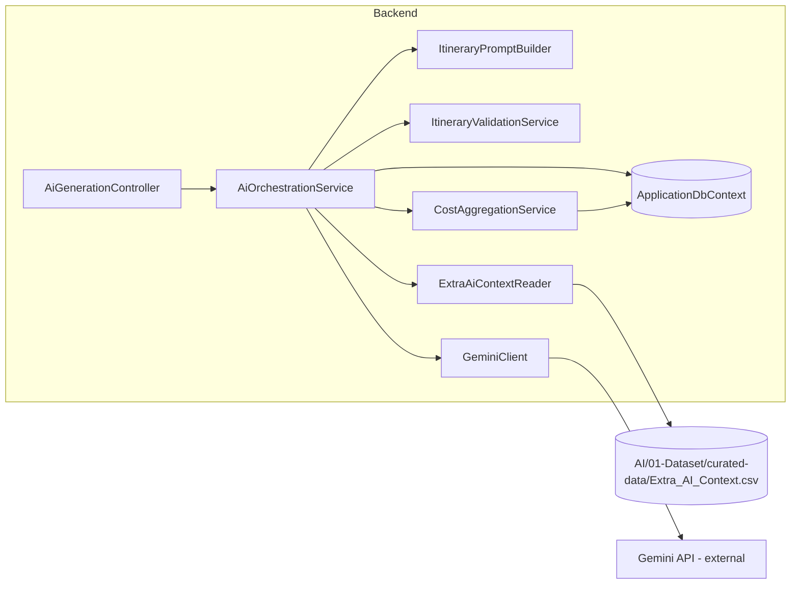

# Triply Backend + AI Architecture Audit

*Generated: 2026-09-21 · Evidence base: full `Backend/Triply.Api` module tree, all 9 EF migrations, live Docker DB inspection, all `AI/` track artifacts, `Docs/01–09`, `Backend/docs/API Contract.md`, 17 test files (75 tests, all passing at audit time). Every major claim cites file/class/method evidence. `UNVERIFIED` is used where the repository cannot prove something.*

> **Update — later on 2026-09-21:** the live DB's `ExchangeRates` (3 rows) and `PlaceInterests` (57 rows) were seeded via the existing AI-track seeders, and `POST /api/destinations/suggestions` was re-verified live (HTTP 200, USD-converted ranking). Sections marked **RESOLVED** below reflect this; provisioning automation (action #1) remains open.

---

## 1. Executive Summary

| Question | Answer |
|---|---|
| Is the documented architecture real? | **Yes.** The modular monolith (ADR-00), Backend-owned Gemini call (ADR-01), and the v2.0.0 schema contract are all genuinely implemented — not aspirational. |
| Is the AI pipeline live? | **Yes — verified end-to-end during this audit.** `POST /api/trips/{tripId}/generate` produced a fully grounded Paris itinerary in 1 attempt against real Gemini (`attemptsUsed: 1`, status `GENERATED`, correct `CostEstimate` rows). |
| Is the 0%-invented-place rule enforced? | **Yes, at two layers**: Gemini structured output (`responseJsonSchema`) + exact name-resolution against active `Place` rows in `ItineraryValidationService`, plus a **DB-level guarantee** via the non-nullable `ItineraryItem.place_id` FK. |
| Who computes cost? | **Backend only.** The model returns zero cost fields (v2.0.0 contract); `CostAggregationService` derives everything from `Place.reference_price`. |
| Biggest gaps | ① Dataset/exchange-rate seeding is **manual** (fresh DBs are nearly empty); ② schema `maxItems` is never narrowed per planning mode (contract §5 step 0 violated); ③ destination grounding misses `IsSupported` in the validator; ④ no runtime JSON-schema validation (deserialization only); ⑤ `raw_output` retention policy unimplemented. |
| Test reality | 75/75 passing, but only **3 unit tests** touch AI orchestration directly; grounding/failure/property tests rely on integration fixtures, not real AI failure injection. |

**Audit verdict:** the system is substantially *more* complete than `PROJECT_STATUS.md` suggests (the E2E Gemini generation it lists as "never run" now works). The remaining risk is concentrated in **data provisioning repeatability** and a handful of **contract-enforcement shortcuts** documented in §14–§17.

---

## 2. Project Structure

```
Triply/
├── Docs/                    # 10 authoritative docs (01–09 + configuration.md)
├── Backend/
│   ├── Triply.Api/          # The entire backend (one project, modular monolith)
│   │   ├── Modules/         # 11 feature modules, 39 C# files
│   │   │   ├── AI-Orchestration/   (9 files: client, orchestrator, prompt, validator, DTOs, options)
│   │   │   ├── Auth/               (controller, JWT service, validators)
│   │   │   ├── Cost/               (aggregation service + controller + DTOs)
│   │   │   ├── Currency/           (conversion service + controller + DTOs)
│   │   │   ├── Destination/        (list + suggestion service + controller + validators)
│   │   │   ├── InterestCategory/   (controller + DTOs)
│   │   │   ├── Itinerary/          (controller + DTOs + write validator)
│   │   │   ├── Place/              (controller + DTOs)
│   │   │   ├── Trip/               (controller, lifecycle state machine, DTOs, validators)
│   │   │   └── User/               (profile/preferences controller + DTOs)
│   │   ├── Data/            # ApplicationDbContext (289 lines) + SeedData.cs (EMPTY STUB)
│   │   ├── Entities/        # 7 entity files (~20 entity classes)
│   │   ├── Migrations/      # 9 migrations + snapshot (initial → AddExchangeRates → UnsupportJerusalem)
│   │   ├── AI-Schemas/      # triply-trip-plan-generation.schema.json (byte-identical to AI track's copy)
│   │   ├── Dockerfile       # Multi-stage sdk:9.0 → aspnet:9.0, binds 0.0.0.0:8080
│   │   └── Program.cs       # 247 lines: full composition root
│   ├── Triply.Api.Tests/    # 17 test files, 75 tests
│   ├── docs/API Contract.md # API reference (Jerusalem-era examples, partially stale)
│   └── docker-compose.yml   # sqlserver:2022 + api, .env-driven
├── AI/
│   ├── 01-Dataset/          # curated-data/*.csv (v1.0.0, 57 places / 3 destinations), seed/*.py
│   ├── 02-Prompt-Engineering/  # prompt templates + json-schema + BACKEND_INTEGRATION_REQUIREMENTS.md
│   ├── 03-Validation/       # AI_OUTPUT_VALIDATION_RULES.md (636 lines), harness.py, validate_schema.py
│   ├── 06-Gemini-Prototype/ # 10 recorded real-Gemini experiments (A–L, results/*.json)
│   ├── 07-Latency-Testing/  # latency_test.py + LATENCY_REPORT.md
│   └── docs/                # TRIPLY_AI_JSON_SCHEMA_CONTRACT_v2.md + SCHEMA_CHANGELOG.md
├── Mobile/                  # Flutter app (lib/core/network/api_client.dart owns all Dio config)
├── Frontend/                # Empty README (Flutter Web build not started — FR-WEB-001)
└── render.yaml              # Deploy blueprint (Dockerfile binds 8080)
```

Notable structural facts:
- `Backend/Triply.Api/Data/SeedData.cs` is an **empty static class** — dataset seeding was delegated to the AI track's Python seeders but nothing automates them.
- `AI/06-Gemini-Prototype` and `AI/07-Latency-Testing` are **prototype/testing** artifacts; the only AI code the backend executes lives in `Backend/Triply.Api/Modules/AI-Orchestration/`.
- `AI/docs/SCHEMA_CHANGELOG.md` line 58 still claims `BudgetTier` join is "marked as TODO" — **stale**, the join is implemented (see §5).

---

## 3. Documentation Reviewed

| Area | Authoritative Document(s) | Key Requirements Extracted |
|---|---|---|
| Overall requirements | `Docs/02_TRIPLY_SRS.md` | FR-AUTH-001/002, FR-TRIP-001–004, FR-AI-001/002, FR-COST-001, FR-DATA-001, NFR-SEC/OBS/TEST; D1 (cost tolerance ±15%), D2–D5 open |
| System architecture | `Docs/03_TRIPLY_System_Architecture.md` | ADR-00 modular monolith; ADR-01 Backend calls Gemini; §9 AI generation lifecycle w/ bounded retry; §12 security boundaries |
| Database | `Docs/05_TRIPLY_Database_Design_Data_Model_Specification.md` | 17 tables; `ItineraryItem.place_id` NOT NULL = FR-AI-002 DB enforcement; `AIGeneration` audit table; §15 cost denormalization; §16 raw_output 30-day retention; §19 trip/AIGeneration state machines |
| AI JSON contract | `AI/docs/TRIPLY_AI_JSON_SCHEMA_CONTRACT_v2.md` | v2.0.0: names-only, no cost fields, `{planning_mode, destination_options[]}`, accommodation trip-scoped, §5 6-step validation pipeline, per-request `maxItems` |
| AI validation rules | `AI/03-Validation/AI_OUTPUT_VALIDATION_RULES.md` | V-001 (0% invented places, exact `Place.name` match, is_active, destination-scoped), V-002 (deterministic budget check) |
| AI dataset | `AI/01-Dataset/DATASET_CURATION_SCHEMA_MAPPING.md`, `seed/DATASET_MANIFEST.json` | v1.0.0: 57 places, 3 destinations, 8 curated CSVs, `Extra_AI_Context.csv` = budget_tier source |
| Tech stack | `Docs/06_TECH_STACK.md`, `Docs/configuration.md` | Env-var config; secrets never committed (`Backend/.env` correctly gitignored — verified via `git ls-files`) |
| API surface | `Backend/docs/API Contract.md` | `POST /api/trips/{id}/generate` FULL/DAY/ITEM semantics; version/concurrency rules |
| System design (UX) | `Docs/08_SYSTEM_DESIGN.md` | Budget-first journey, currency input, "no destinations match budget" UX |

**Conflicts found between documents** (not silently resolved):
1. **Jerusalem/Palestine**: SRS/architecture say "bounded supported list," DB-design examples say "Petra/Rome"; the legacy backend seed had Jerusalem. The curated dataset (authoritative for content) has Paris/Amman/New York. → Resolved during this audit session by unsupporting Jerusalem (`20260921000000_UnsupportJerusalemDestination`). AI track's flag in `AI/progress.md` §79 is now addressed.
2. **SRS D1 (±15% cost tolerance)** vs **Contract v2.0.0** ("no longer applicable"): the code keeps `GeminiOptions.CostTolerancePercent = 15` but never uses it — the contract supersedes; the config value is dead code that should be removed or documented as such.
3. **Contract §8** requires `AIGeneration.model_provider` to declare the schema version — the code stores only the model name (`gemini-flash-lite-latest`). Conflict, currently unresolved (see §17 R-07).

---

## 4. Current Backend Architecture

**ASP.NET Core 9.0** (`net9.0`, EF Core 9.0.10), modular monolith per ADR-00. Verified from `Triply.Api.csproj` + `Program.cs`.

### 4.1 Composition root (`Program.cs`)
- Config: connection string from `ConnectionStrings:Default` (env override `ConnectionStrings__Default`), JWT key required at startup (fail-fast), Gemini section bound to `GeminiOptions`.
- DI registrations (all scoped except `AddHttpClient`): `JwtTokenService`, `IDestinationSuggestionService`, `ICurrencyConversionService`, `ICostAggregationService`, `IAiOrchestrationService`, `IItineraryPromptBuilder`, `IItineraryValidator`, `IExtraAiContextReader`, `IGeminiClient` (typed HttpClient), `TripOwnerHandler`.
- Middleware order: `ExceptionHandlingMiddleware` → security headers (nosniff/DENY/no-referrer) → Swagger (dev) → `UseHttpsRedirection` → CORS (`FlutterClients`) → `UseRateLimiter` → auth → authorization → controllers.
- Rate limiting: `fixed` (10 req/min; 100 in Testing env) + `login` (5/min → 429).
- **Dev/Testing startup runs `db.Database.Migrate()`** — migrations are the only auto-applied seed mechanism.
- Health endpoint `GET /health` → `{status: "ok"}`.

### 4.2 Architecture style — actual, not claimed
- **No repository layer.** Controllers inject `ApplicationDbContext` directly for CRUD; services (`CostAggregationService`, `DestinationSuggestionService`, `AiOrchestrationService`) encapsulate multi-step logic. This is a pragmatic service-oriented monolith, consistent with ADR-00 even though the SRS's "clear module boundaries" is only partially realized: the AI-Orchestration module **directly references** `Modules.Cost` and `Modules.Itinerary` DTOs (cross-module coupling, acceptable at this scale, worth noting).
- **Ownership authorization** via resource-based policy `TripOwner` (`Common/Authorization/TripOwnerHandler`) applied on every trip-scoped endpoint — matches NFR-PRIV-001.
- Configuration is env-var first (docker-compose maps `Jwt__Key`, `Gemini__ApiKey`, `ConnectionStrings__Default` with `__` nesting) — matches `Docs/configuration.md`.

---

## 5. Current AI Architecture

The **production** AI system lives entirely in the backend module; everything else in `AI/` is curation, specification, prototype, or testing.

### 5.1 Component map (production path)

| Component | File | Responsibility |
|---|---|---|
| `AiGenerationController` | `Modules/AI-Orchestration/AiGenerationController.cs` | `POST /api/trips/{tripId:guid}/generate`; ownership check; scope validation (FULL/DAY/ITEM); maps exceptions → 400/404/409/422 |
| `AiOrchestrationService` | `AiOrchestrationService.cs` (966 lines) | Full lifecycle: load trip → validate transition → load dataset context → budget-tier join → build prompt → call Gemini → parse → validate → persist itinerary → compute cost → transition status; bounded retry `MaxRetries+1` (default 3 attempts) |
| `ItineraryPromptBuilder` | `ItineraryPromptBuilder.cs` | `Build()` (DESTINATION_FIRST) + `BuildBudgetFirst()`; names-only grounding lists grouped by category; exact per-day date mapping (`BuildDateRule`) |
| `ItineraryValidationService` | `ItineraryValidationService.cs` (348 lines) | Contract §5 steps 1–3: structure, day/date consistency, duplicate slot detection, **name→row resolution with 0% tolerance**, destination scoping, category rules (accommodation not in days, ≥1 restaurant/day, ≥1 transport/option) |
| `GeminiClient` | `GeminiClient.cs` | REST call to `{BaseUrl}/{Model}:generateContent?key=…` with `responseMimeType=application/json` + `responseJsonSchema`; wraps failures in `GeminiApiException`; guards placeholder API keys |
| `ExtraAiContextReader` | `DatasetContextService.cs` | Parses `Extra_AI_Context.csv` → `{place_id|place_name → budget_tier}`; explicit errors for missing/empty file/columns |
| `GeminiOptions` | `GeminiOptions.cs` | `Model` default `gemini-flash-lite-latest`, `MaxRetries=2`, `TimeoutSeconds=30`, `CostTolerancePercent=15` (dead, see §17 R-10) |
| Response schema | `AI-Schemas/triply-trip-plan-generation.schema.json` | Draft 2020-12; **byte-identical** to the AI track's copy in `AI/02-Prompt-Engineering/json-schemas/` (verified by diff) |

### 5.2 Prototype / testing / non-production artifacts (clearly separated)

| Artifact | Classification | Production use? |
|---|---|---|
| `AI/06-Gemini-Prototype/run_experiments.py`, `results/*.json` | Prototype (10 real generations, 0 hallucinations, schema-valid) | **No** — evidence only |
| `AI/03-Validation/harness.py`, `validate_schema.py` | Testing (Python-side schema + V-001/V-002 harness) | **No** — the backend re-implements the rules in C#; drift risk noted in §17 R-06 |
| `AI/07-Latency-Testing/latency_test.py` | Testing (Flash vs Flash-Lite latency) | **No** — but its outcome selected the default model |
| `AI/01-Dataset/seed/seed_places.py`, `seed_exchange_rates.py`, `Seed_place_interests.py` | Operational tooling (Python/pyodbc) | **Yes — the only dataset provisioning path** (manual) |
| `AI/02-Prompt-Engineering/prompt-templates/*.md` | Specification | The backend's C# prompt builder re-implements these nearly verbatim (verified rule-by-rule) |

### 5.3 Model & call configuration
- Model: `gemini-flash-lite-latest` (default; env `Gemini__Model` can override) — dev `.env` currently drives this; free-tier 20 req/day/model documented in `AI/progress.md`.
- Structured output: `generationConfig.responseMimeType=application/json` + `responseJsonSchema=<full draft-2020-12 schema>` — this is the **schema-shape enforcement layer** (contract §5 step 1).
- Temperature 0.4; timeout 30 s; **API key in URL query string** (Gemini standard, but appears in logs — see §17 R-05).

---

## 6. Database and Data Layer

### 6.1 Implemented entities (vs the 17-table design)

| Docs table | Implemented | Notes |
|---|---|---|
| User | ✅ `ApplicationUser` (Identity) | + `DisplayName`, soft-delete `DeletedAt`; email unique via Identity `NormalizedEmail` index |
| Country / Destination / PlaceCategory / CostCategory / Currency / InterestCategory | ✅ `ReferenceEntities.cs` | All unique indexes per docs §18 (`ApplicationDbContext.cs` lines 35–48) |
| Place | ✅ `Destination.cs` (co-located) | `ReferencePrice`, `IsActive`, `PriceUpdatedAt`; unique composite `(DestinationId, Name)` — **stronger than docs** (docs only assumed uniqueness; DB now enforces it) |
| Trip | ✅ `TripSchema.cs` | All docs §6.9 columns incl. `TotalEstimatedCost`, `Version`, `DeletedAt`; CHECK constraints on status/planning_mode (verified via `TripSchemaConstraintsTests`) |
| TripInterest, Itinerary, ItineraryDay, ItineraryItem | ✅ | `ItineraryItem.PlaceId` is a **non-nullable FK** — the docs' DB-level FR-AI-002 guarantee is real |
| CostEstimate | ✅ | Unique `(TripId, CostCategoryId)` per docs §6.14 |
| AIGeneration | ✅ | `InputSnapshot`, `RawOutput`, `Status` CHECK (PENDING/SUCCEEDED/FAILED_VALIDATION/FAILED_ERROR), `ValidationErrors` |
| Conversation / ConversationMessage | ❌ Not built | Correct — docs mark them Post-MVP; schema pre-designed only |
| **ExchangeRate** | ✅ **beyond docs** | `Entities/ExchangeRate.cs` + migration `20260920080330_AddExchangeRates`; PK=CurrencyId, `RateToUsd`, `UpdatedAt`. Not in Docs/05's 17-table inventory — **documentation lag** |
| **PlaceInterest** | ✅ **beyond docs** | `Entities/PlaceInterest.cs` + `20260917132456_AddPlaceInterest`; interest-aware suggestion ranking (spec: `AI/05-Destination-Suggestion/`) |
| **UserPreferences** | ✅ **beyond docs** | `Entities/UserPreferences.cs`; profile/preferences endpoints |

### 6.2 Migrations (9 + 1 from this audit session)
`InitialCreate` → `SeedReferenceCategoriesViaHasData` → `AddUserEmailUniqueAndDisplayNameMaxLength` → `AddTripSchemaCheckConstraints` → `SeedCountriesCurrenciesDestinations` → `AlignDatasetSchema` → `AddPlaceInterest` → `AddUserPreferencesAndTripMetadata` → `AddExchangeRates` → `UnsupportJerusalemDestination` (2026-09-21).

### 6.3 Seed data — the actual provisioning story
| Data | Source | Automated? |
|---|---|---|
| Categories (8 interest, 5 cost, 5 place) | EF `HasData` in `ApplicationDbContext.cs` | ✅ via migrations |
| Countries PS/JO + USD/JOD + Jerusalem/Amman | EF `HasData` migration `20260914220252` | ✅ via migrations |
| **Paris / New York / EUR / 57 Places** | `AI/01-Dataset/seed/seed_places.py` (natural-key upsert) | ❌ **manual** |
| **ExchangeRates** | `seed_exchange_rates.py` | ✅ **seeded manually 2026-09-21** (3 rows) — still manual |
| **PlaceInterests** | `Seed_place_interests.py` | ✅ **seeded manually 2026-09-21** (57 rows) — still manual |
| `Extra_AI_Context.csv` (budget_tier) | AI track CSV, read at runtime by `ExtraAiContextReader` | File-based; now populated (57/57) |

**Critical data finding:** the live Docker DB had **0 ExchangeRates rows** and **0 PlaceInterests rows** at audit time. Consequences: `DestinationSuggestionService.SuggestAsync` (BUDGET_FIRST) throws `InvalidOperationException: No ExchangeRate configured…` whenever candidates span >1 currency (always true today: EUR/JOD/USD). The audit session seeded Places (57 rows) via `seed_places.py`; **exchange rates and place interests remain unseeded** — BUDGET_FIRST suggestion ranking is **BLOCKED by data, not code**.

**RESOLVED 2026-09-21 (post-audit):** both tables have since been populated with the existing seeders (ExchangeRates = 3, PlaceInterests = 57 — no new data invented), and the live `POST /api/destinations/suggestions` returned **200** with a USD-converted ranking (Amman 596 JOD → 840.36 USD against a 1,500 USD budget). BUDGET_FIRST is no longer data-blocked in the live environment; automation (action #1 / GAP-001) remains the open item.

### 6.4 Who reads/writes what (AI-relevant)

| Entity | Read by AI flow | Written by AI flow |
|---|---|---|
| `Trip` (+ TripInterests, BudgetCurrency) | ✅ prompt context + validation | ✅ Status/Version/DestinationId/UpdatedAt |
| `Place` (+ PlaceCategory, Currency, Destination) | ✅ grounding list (names only — IDs/prices never in prompt for DESTINATION_FIRST; prices never anywhere; `budget_tier` labels in BUDGET_FIRST) | ❌ never |
| `Destination` | ✅ BUDGET_FIRST supported list | ✅ Trip.DestinationId set on first success |
| `Itinerary/Day/Item` | ✅ partial-regeneration context | ✅ full replace in one transaction |
| `CostEstimate` | ❌ | ✅ via `CostAggregationService` |
| `AIGeneration` | ❌ (write-only audit) | ✅ every attempt (status, snapshot, raw output, errors) |
| `ExchangeRate` | ✅ `DestinationSuggestionService` (suggestions only) | ❌ never from AI path |
| `Extra_AI_Context.csv` | ✅ read at generation time (BUDGET_FIRST) | ❌ |

Data classification per Docs/05 §12 holds: user data (Trip prefs), AI-generated data (`ItineraryItem.IsAiGenerated=true`, `AIGeneration.RawOutput`), deterministic system data (`CostEstimate`, `Trip.TotalEstimatedCost`).

---

## 7. Backend ↔ AI Relationship

Per ADR-01, implemented exactly as documented:



- **AI track owns (as spec):** schema JSON, prompt templates, validation-rule definitions, dataset CSVs.
- **Backend owns (as code):** the HTTPS call, rule enforcement, persistence, retry, audit rows.
- The dependency direction is strictly **Backend → AI artifacts** (schema file + CSV + rules), never the reverse. No AI component touches the DB directly; the only filesystem dependency is `ExtraAiContextReader` reading the AI track's CSV at runtime (path `AI:ExtraAiContextPath`, default `../../AI/01-Dataset/curated-data/Extra_AI_Context.csv` relative to `ContentRoot`). **Docker caveat:** the container build context is `./Triply.Api`, so the CSV and its default relative path **do not exist inside the container** — BUDGET_FIRST generation in Docker will fail on `Extra_AI_Context.csv was not found` unless the file is mounted or the path configured. (DESTINATION_FIRST is unaffected: budget tiers are only read in BUDGET_FIRST. **UNVERIFIED in-container** — not exercised during the audit E2E, which used DESTINATION_FIRST.)

---

## 8. Actual End-to-End AI Generation Flow

Reconstructed from `AiGenerationController.Generate()` → `AiOrchestrationService.GenerateItineraryAsync()` (lines 75–445), and **validated live** (real Gemini call succeeded during this audit):

```mermaid
sequenceDiagram
    participant C as Client (Flutter)
    participant AC as AiGenerationController
    participant O as AiOrchestrationService
    participant DB as SQL Server (EF Core)
    participant V as ItineraryValidationService
    participant G as GeminiClient
    participant GM as Gemini API
    participant CS as CostAggregationService

    C->>AC: POST /api/trips/{tripId}/generate (JWT, TripOwner-checked)
    AC->>O: GenerateItineraryAsync(tripId)
    O->>DB: Load Trip + interests + BudgetCurrency
    Note over O: Validate lifecycle transition (DRAFT→GENERATING)
    O->>DB: Load active Places (+category/currency/destination)<br/>scoped to DestinationId if DESTINATION_FIRST
    alt BUDGET_FIRST
        O->>DB: Load supported Destinations (IsSupported)
        O->>O: ExtraAiContextReader → join budget_tier by Place.Id or Name
        Note over O: Hard fail if any active place lacks budget_tier
    end
    O->>DB: Insert AIGeneration (PENDING, attempt N, input_snapshot)
    O->>O: ItineraryPromptBuilder.Build / BuildBudgetFirst
    O->>G: GenerateJsonWithSchemaAsync(prompt, systemInstruction, schema)
    G->>GM: POST v1beta/models/{model}:generateContent<br/>responseJsonSchema + responseMimeType=json
    GM-->>G: JSON text
    G-->>O: rawText (also stored to AIGeneration.RawOutput)
    O->>O: JsonSerializer.Deserialize<GeminiItineraryOutputDto>
    O->>V: ValidateAsync(trip, output)
    V->>DB: Resolve destination_name → Destination (note: not IsSupported-filtered)
    V->>DB: Resolve every place_name → active Place, destination-scoped
    Note over V: 0% tolerance — any unresolved name fails the option
    alt invalid
        O->>DB: AIGeneration = FAILED_VALIDATION (+errors)
        Note over O: retry up to MaxRetries+1 attempts
    else valid
        O->>DB: Transaction: delete old itinerary, insert Itinerary/Days/Items<br/>(estimated_cost copied from Place.reference_price;<br/>accommodation = nights × reference_price on day 1 MORNING, order 0)
        O->>CS: GenerateFromItineraryAsync(tripId)
        CS->>DB: Group item costs by CostCategory → replace CostEstimate rows<br/>+ update Trip.TotalEstimatedCost
        Note over CS: Throws if items span >1 currency
        O->>DB: Trip → GENERATED, Version++, AIGeneration = SUCCEEDED
        O-->>AC: AiGenerationResult (itinerary + cost)
        AC-->>C: 200 {aiGenerationId, attemptsUsed, tripVersion, itinerary, cost}
    end
    Note over O,AC: All attempts failed → Trip → DRAFT,<br/>AC returns 422 {message, aiGenerationId, attemptsUsed, errors}
```

**Step-by-step with file/method evidence:**

| # | Step | Evidence | Failure path |
|---|---|---|---|
| 1 | Auth + ownership | `AiGenerationController.Generate` → `AuthorizeAsync(…, "TripOwner")` | 404 (not 403 — intentional non-disclosure) |
| 2 | Scope routing | `scope == "FULL" ? GenerateItineraryAsync : RegeneratePartialAsync` | 400 for bad scope; 409 on version conflict / invalid state |
| 3 | Trip preconditions | `GenerateItineraryAsync` lines 75–96: null trip → KeyNotFound; DESTINATION_FIRST without destination → InvalidOperation; status gate via `TripLifecycle.CanTransition` | 404 / 409 |
| 4 | Status → GENERATING | `TripLifecycle.Transition(trip, Generating)` then `SaveChanges` | — |
| 5 | Dataset load | lines 125–147: `_db.Places.Where(p => p.IsActive)` (+destination scope in DESTINATION_FIRST); **empty result → immediate `FAILED_ERROR` result, "No active places are curated yet"** (this was the live bug fixed by seeding during the audit) | Trip → DRAFT, 422 |
| 6 | budget_tier join (BUDGET_FIRST only) | lines 148–163 + `ExtraAiContextReader.ReadBudgetTiersAsync`; missing tier for any place → `InvalidOperationException` | 409 |
| 7 | AIGeneration row per attempt | lines 222–232: PENDING, `ModelProvider = _options.Model`, JSON `InputSnapshot` (destination, travelers, dates, interests, dayCount, mode) | — |
| 8 | Prompt + Gemini call | `GeminiClient.GenerateJsonWithSchemaAsync` (system instruction forbids IDs/prices/prose) | `GeminiApiException` → AIGeneration FAILED_ERROR, retry |
| 9 | Parse | `JsonSerializer.Deserialize<GeminiItineraryOutputDto>`; JSON exception → null → FAILED_VALIDATION, retry | retry |
| 10 | Validate | `ItineraryValidationService.ValidateAsync` (see §10) | FAILED_VALIDATION, retry |
| 11 | Persist | Transaction: delete existing itinerary → insert new `Itinerary`/`ItineraryDay`/`ItineraryItem` with `PlaceId` resolved server-side, `EstimatedCost = ReferencePrice` (accommodation × nights) | transaction rollback on failure |
| 12 | Cost | `CostAggregationService.GenerateFromItineraryAsync` — **deliberately before** status flip (comment TASK48: keeps trip retry-able if aggregation fails) | AIGeneration FAILED_ERROR, Trip → DRAFT, rethrow → 409 |
| 13 | Finalize | `Trip → GENERATED`, `Version++`, AIGeneration SUCCEEDED | — |
| 14 | Response | 200 with `aiGenerationId, attemptsUsed, tripVersion, itinerary, cost`; failure → 422 with `errors[]` | — |

**Live verification (2026-09-21, Docker):** registered user → `POST /api/trips` (DESTINATION_FIRST, destinationId=3 Paris, 2026-10-10→13, 2 travelers) → `POST …/generate` → **200, attemptsUsed=1**, itinerary: Novotel Paris ×3 nights (€420), CDG transfer (€56), Louvre (€22), Bouillon Chartier (€20), Eiffel Tower (€23.50), Seine cruise (€17)…; `CostEstimate`: Accommodation 420, Transportation 58.15, Food 428 (EUR). Trip status `GENERATED`, version 2.

---

## 9. AI Grounding and Place Validation

Tracing the "no invented places" guarantee layer by layer:

1. **Where Places come from:** SQL Server `Places` table — the DB is the runtime source of truth (`AI_OUTPUT_VALIDATION_RULES.md` §4.4 agrees). Curated by `AI/01-Dataset/curated-data/Place.csv` via `seed_places.py`.
2. **Selection:** `IsActive == true` only; DESTINATION_FIRST additionally scoped `DestinationId == trip.DestinationId`; BUDGET_FIRST loads all active places (all 3 destinations) + supported-destination list.
3. **Does Gemini see the curated places explicitly?** Yes — `ItineraryPromptBuilder.BuildPlaceList(ByDestination)` renders every qualifying place name grouped by category ("[ATTRACTION]\n- Louvre Museum"), names only. **DESTINATION_FIRST lists no prices**; **BUDGET_FIRST lists budget_tier labels** (BUDGET/MID_RANGE/LUXURY), still no numbers. IDs never enter the prompt.
4. **How output names are validated:** `ItineraryValidationService` collects every `destination_name` + `place_name` (accommodation + all daily items), resolves each against `_db.Places.Where(p => names.Contains(p.Name) && p.IsActive)`, **case-sensitive ordinal match** (`StringComparer.Ordinal`), then checks `place.DestinationId == option destination` and (when set) `== trip.DestinationId`. Any unresolved name → error "FR-AI-002, 0% invented places" → whole attempt FAILED_VALIDATION.
5. **Category rules on resolved rows:** accommodation must resolve to an ACCOMMODATION-category place; no ACCOMMODATION-category item may appear in `days[]`; ≥1 RESTAURANT per day; ≥1 TRANSPORT per option.
6. **No curated places at all:** `GenerateItineraryAsync` short-circuits with `FAILED_ERROR` "No active places are curated yet…" before calling Gemini (verified live during the audit's first fix).
7. **Unresolvable name in output:** whole option fails; bounded retry; 422 to client; every attempt auditable in `AIGenerations`. No partial writes (transaction).
8. **DB backstop:** `ItineraryItem.PlaceId` NOT NULL FK → RESTRICT. Even if application validation were bypassed, persistence cannot fabricate a place. **The 0%-invented-place requirement is enforced at prompt, validation, and schema levels — genuine, not prompt-only.**

**Grounding gaps (contract deviations):**
- **Destination resolution is not `IsSupported`-filtered** in the validator (`supportedDestinations` query omits the filter; `AiOrchestrationService` uses it only for the BUDGET_FIRST prompt list). A model could return an unsupported-but-existing destination (e.g., Jerusalem, id=1) and pass validation. MEDIUM risk (R-04) — the unsupporting of Jerusalem during this session makes this concrete.
- **Name collisions:** resolution uses `ToDictionary(p => p.Name, p => p)` — an active duplicate name within a destination would throw `ArgumentException` at runtime (crash → 500 via middleware, not FAILED_VALIDATION). Mitigated by the new unique `(DestinationId, Name)` index, but the validator doesn't fail *gracefully* on duplicates. LOW.
- **Case-sensitivity asymmetry:** matching is ordinal-case-sensitive while `time_slot` comparisons use `ToUpperInvariant`. A model returning "louvre museum" fails grounding (correct per contract, but brittle — the schema's enum enforcement doesn't cover names). LOW, documented contract behavior.

---

## 10. AI Output Validation

### Layer 1 — Schema-shape validation (before backend logic)
- **Enforced by Gemini structured output**: `responseJsonSchema` = full draft-2020-12 schema (root `{planning_mode, destination_options[]}` with `maxItems: 3` static, min 1; per-field types/enums; `$defs/$ref`).
- **Then deserialization** into `GeminiItineraryOutputDto` (System.Text.Json, case-insensitive, `JsonPropertyName` snake_case). Parse failure → FAILED_VALIDATION "not valid JSON".
- **Gap:** no *in-process* `JsonSchema` re-validation — the backend trusts Gemini's `responseJsonSchema` enforcement plus DTO binding. Contract §5 step 1 says "JSON parses; required fields present; types/enums correct" — DTO binding catches most of this, but a malicious/errant provider response violating a constraint the Gemini layer didn't enforce (e.g., `nights: -3`) is caught only by the business validator (`Nights < 1` check exists — OK) rather than a schema engine. Direct Gemini calls (what `GeminiClient` does) *do* pass the schema, so residual risk is provider-version drift. **LOW–MEDIUM.**
- **Contract §5 step 0 violated:** the schema file is loaded **as-is**; `destination_options.maxItems` is **never narrowed to 1 for DESTINATION_FIRST** (the validator would catch >1 options with the correct error, but the prompt+schema still *ask* Gemini for up to 3 — wasted tokens/latency and a avoidable validation-retry mode). Evidence: `AiOrchestrationService` lines ~216–219 parse the file without mutation; schema on disk has static `maxItems: 3` (line 22). **MEDIUM (R-02).**

### Layer 2 — Business validation (before persistence, after Gemini)
`ItineraryValidationService.ValidateAsync`, in order:
1. `planning_mode` present + equals trip mode; `destination_options` non-empty; count ≤ max (1 or 3); distinct names.
2. Per option: accommodation present, `place_name` non-empty, `nights ≥ 1`; days count == trip duration (defaults 3 when dates unset); `day_number` contiguous from 1; `date == start_date + i` (exact mapping — the prompt also spells out the exact dates, fixing a previously documented hallucination); every day non-empty; every item has `place_name`, valid time_slot enum (MORNING/AFTERNOON/EVENING, case-insensitive-in), `order_index ≥ 1`; no duplicate `(time_slot, order_index)` per day.
3. **Grounding (§9 above)** — 0% tolerance, destination-scoped, category checks.
- Retries: `MaxRetries + 1` = 3 attempts by config; each failed attempt gets its own `AIGeneration` row (status FAILED_VALIDATION/FAILED_ERROR, joined errors). After exhaustion: Trip → DRAFT, result 422 with all errors. **Matches FR-AI-002 and SRS journey 6.**

### Layer 3 — Persistence validation
- Transactional replace of the itinerary (delete-then-insert inside one `BeginTransactionAsync`).
- FK NOT NULL `PlaceId` guarantees grounded rows only.
- `ItinerariesController` write-validator (`WriteItineraryRequestValidator`) governs *user* edits (separate from AI path).
- **Can invalid AI output reach the DB?** Only after passing layers 1–2; nothing else observed. The one bypass is the BUDGET_FIRST budget check (below).

### Budget validation (V-002) — **GAP**
Contract §5 step 4 / `AI_OUTPUT_VALIDATION_RULES.md` V-002 require a deterministic budget check: in BUDGET_FIRST, options over budget are dropped; zero surviving → FAILED_VALIDATION. **The backend implements neither.** `AiOrchestrationService` persists `output.DestinationOptions.First()` with no budget comparison anywhere in the AI path (budget only appears in suggestions via `DestinationSuggestionService`). `Docs/08` UX shows "no destinations match your budget" flows that today depend on the *suggestion* endpoint, not generation. **Status: DOCUMENTED ONLY — MEDIUM gap (see §14, §17 R-03).** Also note contract's own open item: minimum surviving options policy undecided — the backend should not implement step 4 until that's signed off (it isn't; contract is still draft pending sign-off §7).

---

## 11. Cost Estimation and Currency Flow

### Who computes what
| Figure | Computed by | Where |
|---|---|---|
| AI cost fields | **Nobody** — the model outputs none (v2.0.0) | `GeminiItineraryOutputDto` has zero cost fields; prompt rules #3 forbid them |
| `ItineraryItem.EstimatedCost` | Backend, at persist time = `Place.ReferencePrice` (accommodation: × `nights`) | `AiOrchestrationService` persist block |
| `CostEstimate` rows / `Trip.TotalEstimatedCost` | Backend deterministic aggregation | `CostAggregationService.GenerateFromItineraryAsync` → groups item costs by `CostCategoryId`, replaces rows, updates total |
| Suggestion-level conversion | Backend | `DestinationSuggestionService` (below) |

No duplicated responsibility — matches Docs/05 §12/§14 ("CostEstimate is system-computed, never LLM-generated") and contract v2.0.0 change #1–2.

### Currency model (actual)
- `Place.CurrencyId` — one price per place, in its destination's currency. Never converted, never duplicated (explicit in `ICurrencyConversionService` XML doc).
- `CostAggregationService` **throws** when items span >1 currency (`"Itinerary items reference places in more than one currency…"`) — all places within a destination share a currency by construction, so per-trip this holds post-selection.
- `ExchangeRate.RateToUsd` (PK `CurrencyId`) — USD-pegged rates, manually updated (no background jobs by design; `ExchangeRate.cs` documents the decision).
- `CurrencyConversionService` — pure USD-cross conversion: `amount * rate[from] / rate[to]`; `ConvertManyAsync` batches; throws `InvalidOperationException` listing missing currency IDs.
- **Used by:** `DestinationSuggestionService` — BUDGET_FIRST suggestions rank *all* supported destinations by converting each destination's summed `ReferencePrice` into the budget currency via a single batched round-trip ("1-unit factor" technique — correct: avoids collapsing same-currency destinations). Filter `EstimatedCostInBudgetCurrency <= BudgetAmount`, rank by interest-match count then converted cost. Response carries both native and converted amounts (`IsEstimated=true`).
- **AI sees:** no currency amounts at all. In BUDGET_FIRST, only `budget_tier` labels (from CSV, not DB) — verified `BuildPlaceListByDestination` renders `(tier)` suffixes only.
- **Persisted costs** are always in the **destination currency** (the places' currency). There is **no budget-vs-total comparison in the AI path** (see §10 budget gap); no API field exposes budget-currency equivalents for a generated trip (only suggestions carry `EstimatedCostInBudgetCurrency`).
- **Live data state (updated 2026-09-21):** `ExchangeRates` now has **3 rows** (seeded via `seed_exchange_rates.py`) → cross-currency suggestions work live. The robustness gap stands: tests seed fixtures in-test and **no test covers the unseeded-rates runtime failure** (§18).

**Verdict:** matches documentation in design; **operationally live as of 2026-09-21** (rates seeded); the V-002 gap noted above remains.

---

## 12. API Contracts Relevant to AI

| Endpoint | Method | Auth | Validated? | AI? | Persistence | Verified |
|---|---|---|---|---|---|---|
| `/api/auth/register` | POST | anon, rate `fixed` | FluentValidation + Identity policy + duplicate-email check | — | creates user, returns JWT | ✅ tests + live |
| `/api/auth/login` | POST | anon, rate `login` (5/min) | generic 401 (no user enumeration) | — | — | ✅ tests |
| `/api/trips` | GET | JWT | ownership scope | — | read | ✅ |
| `/api/trips` | POST | JWT | `CreateTripRequestValidator` + destination/currency/interest existence checks | — | creates Trip (DRAFT) | ✅ tests + live |
| `/api/trips/test-create` | POST | JWT | **none** — creates empty trip | — | creates Trip | ⚠ **test-only endpoint shipped in `TripsController` — should not be in production binary** (R-09) |
| `/api/trips/{id}` | GET | JWT + TripOwner | — | — | read (+itinerary+cost) | ✅ |
| `/api/trips/{id}` | PATCH / PUT | JWT + TripOwner + `ExpectedVersion` | validators | — | optimistic concurrency | ✅ tests |
| `/api/trips/{id}/save|archive|restore` | POST | JWT + TripOwner | lifecycle gate | — | status transitions | ✅ tests |
| **`/api/trips/{id}/generate`** | POST | JWT + TripOwner, rate `fixed` | scope FULL/DAY/ITEM; `ExpectedVersion` required for DAY/ITEM | **full orchestration** | itinerary + cost + AIGeneration + trip status/version | ✅ **live E2E this audit** |
| `/api/trips/{id}/itinerary` | POST (manual write) | JWT + TripOwner | `WriteItineraryRequestValidator` | — | items (user edits) | ✅ tests |
| `/api/trips/{id}/itinerary/items/{itemId}` | PATCH | JWT + TripOwner | — | — | single-item edit, flips `IsAiGenerated=false` | ✅ tests |
| `/api/destinations` | GET | JWT | — | — | supported list (`IsSupported`) | ✅ tests + live (Jerusalem hidden) |
| `/api/destinations/suggestions` | POST | JWT | `DestinationSuggestionValidator` | deterministic (no Gemini) | — | ✅ tests |
| `/api/interest-categories`, `/api/currencies` | GET | JWT | — | — | reference reads | ✅ |
| `/api/places/{id}` | GET | JWT | — | — | place detail (images/openingHours empty) | ✅ tests |
| `/api/users/me`, `/preferences`, `/stats` | GET/PATCH/PUT | JWT | validators | — | profile data | ✅ tests |
| `/health` | GET | anon | — | — | — | ✅ live |

Error handling: `ExceptionHandlingMiddleware` → ProblemDetails; AI failure specifically → **422** `{message, aiGenerationId, attemptsUsed, errors[]}` (distinct from 409 concurrency/state and 400 validation) — satisfies SRS §11 "clear, distinguishable error."

**Doc drift:** `Backend/docs/API Contract.md` still shows Jerusalem/Palestine examples (lines 219–220, 291–292) and does not document `EstimatedCostInBudgetCurrency` on suggestions. P2 doc update.

---

## 13. Current Implementation Status

| Capability | Status | Evidence / Caveat |
|---|---|---|
| Authentication (register/login/JWT) | **WORKING** | 75-test suite green; live register/login |
| Trip CRUD + lifecycle + concurrency | **WORKING** | `TripLifecycle`, version checks, tests |
| Destination-first trip request | **WORKING** | Live E2E |
| Budget-first suggestion (endpoint) | **WORKING (live)** | rates + interests seeded 2026-09-21 → live call returned 200 with USD-converted ranking |
| **AI generation (full itinerary)** | **WORKING** | Live Gemini E2E, 1 attempt, grounded, cost correct |
| AI grounding (V-001) | **WORKING** (2-layer + DB FK) | §9; destination `IsSupported` gap noted |
| AI schema validation | **PARTIALLY WORKING** | Gemini-side enforcement; no in-process schema engine; `maxItems` not narrowed (R-02) |
| AI failure handling / bounded retry | **WORKING** | per-attempt audit rows, 422, trip→DRAFT |
| Cost estimation | **WORKING** | live correct breakdown; TASK48 ordering fix documented in code |
| Currency conversion service | **WORKING** | service + tests fine; live DB seeded (3 rates, 2026-09-21) |
| Partial regeneration (DAY/ITEM) | **WORKING (code+tests)** | 9 integration tests; not exercised against live Gemini in this audit — **UNVERIFIED live** |
| Save/archive/restore | **WORKING** | tests |
| Profile/preferences/stats | **WORKING** | tests |
| Dataset provisioning | **PARTIALLY WORKING (manual)** | Python seeders; migrations cover only reference rows; `SeedData.cs` empty |
| Conversational refinement (FR-TRIP-005) | **NOT IMPLEMENTED** | post-MVP, correct |
| Flutter mobile integration | **PARTIALLY WORKING** | real API repos wired (home/trips/overview/auth); **UNVERIFIED against live backend in this audit**; IP fix applied during session |
| Flutter Web (FR-WEB-001) | **NOT IMPLEMENTED** | `Frontend/` empty; PR #51 merged nothing into tree |
| Deployment | **PARTIALLY WORKING (dev-only)** | docker-compose works locally; `render.yaml` exists; no CI/CD; D3 undecided |

---

## 14. Documentation vs Implementation Gap Analysis

| # | Requirement | Documentation | Current Implementation | Status | Evidence | Required Action |
|---|---|---|---|---|---|---|
| G-01 | FR-AI-001 schema-driven output | Contract v2.0.0 §3–4 | Exact DTO mirror + Gemini `responseJsonSchema`; schema files byte-identical | **IMPLEMENTED** | `AiOrchestrationDtos.cs`; diff verified | — |
| G-02 | Contract §5 step 0 — per-mode `maxItems` | maxItems 1 (DEST) / 3 (BUDGET) | Schema used verbatim (`maxItems: 3` always); validator checks post-hoc | **PARTIALLY IMPLEMENTED** | `AiOrchestrationService` schema load (~line 216); schema line 22 | Clone schema per request, set maxItems=1 for DESTINATION_FIRST |
| G-03 | Contract §5 step 4 / V-002 budget check | BUDGET_FIRST: drop over-budget options; zero survivors → fail | **Not implemented** in AI path; budget only in suggestions | **DOCUMENTED ONLY** | absent from `AiOrchestrationService`; `ICurrencyConversionService` unused there | Decide minimum-surviving-options policy (contract §9 open), then implement |
| G-04 | FR-AI-002 0% invented places | SRS; Validation rules V-001 | Prompt + exact-name resolution + NOT NULL FK | **IMPLEMENTED** | §9 evidence chain | — |
| G-05 | Validator must check `IsSupported` for destination | Contract §4.2 ("supported list given in prompt context"); V-001 §4.6 `is_supported = true` | Validator query has **no** `IsSupported` filter | **CONFLICTING/BUG** | `ItineraryValidationService` ~line 253 | Add `.Where(d => d.IsSupported)` |
| G-06 | Raw output retention ≤30 days | Docs/05 §16 | `RawOutput` stored, **never purged** | **MISSING** | no cleanup job/endpoint anywhere | P2: retention job or explicit deferral decision |
| G-07 | Contract §8: schema version declared per generation | model_provider/prompt must declare target schema version | `ModelProvider` stores model name only; no schema version column | **CONFLICTING** | `AIGeneration` insert; `GeminiOptions.Model` | Add `SchemaVersion` column or embed in snapshot; needs lead sign-off (contract is draft) |
| G-08 | FR-DATA-001 dataset versioned + reviewed | DATASET_MANIFEST v1.0.0, REVIEW_RECORD | Versioned + reviewed in repo; **DB import manual** | **PARTIALLY IMPLEMENTED** | `seed_places.py`; empty `SeedData.cs` | Automate seeding for dev (P1) |
| G-09 | Exchange rates exist for comparisons | implied by `ExchangeRate` design (beyond docs) | Table exists; **3 rows live** (seeded 2026-09-21) | **IMPLEMENTED (manual run)** | live DB query post-seed | Fold `seed_exchange_rates.py` into provisioning automation (action #1) |
| G-10 | PlaceInterest data (spec-ready) | `Interest_Aware_Destination_Suggestions_Spec.md` | Code ready (`MatchCount` join); **57 rows live** (seeded 2026-09-21) | **IMPLEMENTED (manual run)** | live DB query post-seed; `DestinationSuggestionService` | Fold `Seed_place_interests.py` into provisioning automation (action #1) |
| G-11 | NFR-OBS-001 logging | ILogger + EF logs | Implemented; **plus a leftover debug log** dumping `ItineraryItem` tracker on every generation ("DAY regeneration ItineraryItem tracker") | **PARTIALLY IMPLEMENTED (noise)** | `AiOrchestrationService` lines ~96–110 | Remove/re-gate the debug block |
| G-12 | SRS D1 ±15% cost tolerance | Open decision | `GeminiOptions.CostTolerancePercent` dead config | **CONFLICTING** (contract removed the need) | `GeminiOptions.cs` | Delete or mark obsolete |
| G-13 | FR-WEB-001 web parity | Must-have | Not started | **MISSING** | empty `Frontend/` | P2 build task (mobile-track) |
| G-14 | FR-TRIP-005 conversation | Post-MVP | Not built; schema pre-designed in docs only | **DOCUMENTED ONLY (by design)** | no entities | None (correct) |
| G-15 | Docs/05 17-table inventory | 17 tables | 20 (ExchangeRate, PlaceInterest, UserPreferences extra) | **DOCUMENTATION LAG** | entities list | Update Docs/05 or add ADR note |
| G-16 | API contract examples | Jerusalem-era examples | Jerusalem now unsupported | **STALE** | `API Contract.md` lines 219, 291 | Update examples |
| G-17 | Migrations-only reproducibility | (implied by NFR-MAINT) | Fresh DB: reference rows only; 57 places/destinations absent; tests assert only Amman | **PARTIALLY IMPLEMENTED** | test failure observed during audit (`GetDestinations_ReturnsSupportedDestinations`) | P1 seeding strategy (§20) |

---

## 15. Missing Components

### Backend
1. **Budget check (V-002) in the AI path** — blocked on the contract's open "minimum surviving options" decision; needs a signed decision then implementation in `AiOrchestrationService` persist path.
2. **In-process JSON-schema validation** (optional hardening) — e.g. validate `rawText` against the schema before DTO binding, so provider drift cannot bypass shape rules.
3. **`raw_output` retention** job/endpoint (G-06).
4. **AIGeneration schema-version tracking** (G-07).
5. **Removal of `/api/trips/test-create`** from production (R-09).
6. **Graceful duplicate-place-name handling** in validator/lookup (currently an unhandled `ArgumentException` path; DB unique index now prevents the data condition, but the code should fail as FAILED_VALIDATION, not 500).

### AI
7. **No missing production AI components.** Prototype/harness/latency artifacts are complete for their purpose. The Python validation harness and the C# validator are parallel implementations of the same rules — a **parity test** (same fixture JSONs run through both) would prevent drift (R-06).
8. **Prompt template ↔ C# builder parity check** — currently maintained by hand; a lightweight test asserting the C# prompt contains the 9 contract rules would codify it.

### Integration
9. **`Extra_AI_Context.csv` availability inside the Docker image** (default path resolves outside build context) — mount the CSV in compose or copy it into the image; document `AI:ExtraAiContextPath`.
10. **`maxItems` per-mode schema mutation** (G-02) — backend-owned, one-line per request.

### Data
11. **Exchange rates** — run seeder (or add to provisioning). Blocks BUDGET_FIRST suggestions at runtime.
12. **PlaceInterests** — run seeder (48 non-TRANSPORT places per spec) or degrade gracefully.
13. **Automated dataset provisioning for dev/test** — the single highest-leverage fix (G-08/G-17): either (a) extend `Program.cs` dev-only seeding to call a CSV importer, or (b) a `docker compose` init container running the Python seeders. Fresh clones currently cannot generate itineraries.

---

## 16. Components Requiring Modification

| File | Class/Method | Current behavior | Required behavior | Reason | Doc basis | Impact |
|---|---|---|---|---|---|---|
| `Modules/AI-Orchestration/ItineraryValidationService.cs` | `ValidateDestinationOption` (destinations query) | Resolves `destination_name` without `IsSupported` filter | Add `.Where(d => d.IsSupported)` | Unsupported destinations (Jerusalem) pass grounding | Contract §4.2, V-001 §4.6 | Tiny; closes grounding hole |
| `Modules/AI-Orchestration/AiOrchestrationService.cs` | `GenerateItineraryAsync` schema load | Parses static schema file | Deep-clone + set `destination_options.maxItems = 1` for DESTINATION_FIRST | Contract §5 step 0; avoids retry loops on multi-option outputs | Contract §5 | Small; saves tokens/latency |
| `Modules/AI-Orchestration/AiOrchestrationService.cs` | tracker-debug block (lines ~96–110) | Logs full ItineraryItem change-tracker dump every generation at Warning | Remove or gate behind `if (_logger.IsEnabled(LogLevel.Trace))` and demote | Log noise on production path; looks like leftover debugging | NFR-OBS-001 | Trivial |
| `Modules/AI-Orchestration/GeminiOptions.cs` | `CostTolerancePercent` | Dead config value | Remove (or comment as intentionally unused post-v2.0.0) | Misleads readers into thinking AI costs are tolerance-checked | Contract §1a #1–2 | Trivial |
| `Controllers/TripsController.cs` | `TestCreate` endpoint | Open test-only trip creation in production binary | Delete or compile-gate (`#if DEBUG`) | Security surface | NFR-SEC-001 | Trivial |
| `Data/SeedData.cs` (or Program.cs dev path) | — | Empty stub | Implement dev-only CSV import OR wire compose init container for Python seeders | Fresh environments cannot run the core feature | FR-DATA-001 | Medium effort, highest leverage |
| `Backend/docs/API Contract.md` | examples | Jerusalem/Palestine samples; suggestions missing `EstimatedCostInBudgetCurrency` | Refresh samples; document new fields | Docs/code divergence | — | Trivial |
| `Docs/05_…Data_Model_Specification.md` | §4 inventory | 17 tables | Add ExchangeRate, PlaceInterest, UserPreferences (with justification) | Keep authoritative doc truthful | — | Trivial |

No re-architecture is warranted; all changes preserve the existing module structure (Rule 10).

---

## 17. Architectural Risks

| ID | Risk | Severity | Rationale |
|---|---|---|---|
| R-01 | **Non-reproducible environment**: fresh DB lacks the 57-place dataset; feature silently degrades to "no active places" 422 | **HIGH** | Verified live (the exact bug that triggered this audit's first fix). Core MVP flow fails on any new clone/CI/deploy. |
| R-02 | `maxItems` never narrowed per mode | **MEDIUM** | Contract violation (§5 step 0); wasted tokens; avoidable FAILED_VALIDATION retries; no data-integrity risk (validator catches). |
| R-03 | V-002 budget check absent in AI path | **MEDIUM** | BUDGET_FIRST generation can return an over-budget plan; UX contract promises budget-fit options. Blocked on undecided product policy — must be decided, not coded blindly. |
| R-04 | Validator accepts unsupported destinations | **MEDIUM** | Concrete post-Jerusalem-unsupport; grounding exists but not filtered to the supported list. |
| R-05 | **API key in URL query string** (`?key=…`) | **MEDIUM** | Gemini standard, but keys leak into any request logging/proxies. Mitigation: `x-goog-api-key` header (supported by Gemini). Http client logging is currently minimal, lowering immediate exposure. |
| R-06 | Dual validation implementations (Python harness vs C#) can drift | **LOW–MEDIUM** | Same rules maintained twice with no parity test. SCHEMA_CHANGELOG already lags (§2). |
| R-07 | No schema-version provenance on `AIGeneration` | **LOW** | Contract §8 unimplemented; debugging older generations after future schema bumps is harder. Contract itself is unsigned draft, so severity is contained. |
| R-08 | **Concurrency on FULL generation**: two parallel `/generate` calls both pass the DRAFT→GENERATING check (read-then-write without version guard; unlike partial regen which uses `ExpectedVersion` + `ExecuteUpdate`) | **MEDIUM** | Duplicate Gemini spend; last-writer-wins itinerary; no corruption (transactions) but wasted quota and confusing state. Rate limiter (10/min) partially masks. |
| R-09 | `/api/trips/test-create` shipped in production binary | **MEDIUM** | Unvalidated trip creation endpoint; auth required but no input validation; pollutes contract. |
| R-10 | Dead `CostTolerancePercent` config | **LOW** | Misleading only. |
| R-11 | `ExtraAiContextReader` filesystem dependency inside containers | **MEDIUM** (Docker), LOW (bare-metal) | BUDGET_FIRST cannot run in the current image; silent until first BUDGET_FIRST generation attempt in Docker. |
| R-12 | `GeminiClient` timeout vs orchestration retry math: 3 attempts × 30 s + validation ≈ up to ~100 s request | **LOW** | Client-side timeouts (Dio 15 s mobile) may abort before server finishes; UX shows error while generation actually succeeds server-side. Verify mobile timeout (15 s) vs expected latency (LATENCY_REPORT: **UNVERIFIED** numbers in this audit). |
| R-13 | Secrets hygiene | **LOW (current)** | `Backend/.env` correctly gitignored; `.env.example` placeholders only; JWT/Gemini keys required at startup. No secrets in source found. |
| R-14 | No AI-output cost, no AI-owned persistence, no prototype leakage into prod | — | **Checked and clean** — explicitly listing because the audit asked: `AI/06` and `AI/07` are not referenced by the backend build (verified by namespace/import inspection). |

---

## 18. Test Coverage and Validation Status

**Suite: 75/75 passing** (run during this audit against the Docker SQL Server; 17 files).

### Covered
| Area | Tests | File |
|---|---|---|
| Auth (register/login/display-name/dup-email) | multiple | `AuthEndpointsTests`, `UserIdentityTests` |
| Ownership boundary / cross-user access | multiple | `AuthorizationBoundaryTests`, `SecurityHardeningTests` |
| Trip CRUD, lifecycle, version conflicts | multiple | `TripIntegrationTests`, `TripSchemaConstraintsTests` |
| Itinerary write rules, partial-regeneration DAY/ITEM | 9 | `PartialRegenerationIntegrationTests` (includes expected-version 409s, accommodation-item protection) |
| Cost aggregation (single-currency invariant, totals) | 7 | `CostAggregationIntegrationTests` |
| Destination suggestion incl. interest ranking + conversion | multiple | `DestinationSuggestionIntegrationTests` (seeds its own PlaceInterests/rates) |
| Reference data + constraints | multiple | `ReferenceTableConstraintsTests`, `FlutterReferenceDataIntegrationTests` (now asserts Jerusalem absent) |
| Middleware/security headers | multiple | `ExceptionHandlingMiddlewareTests`, `SecurityHardeningTests` |

### AI-specific — thin but present
- `AiOrchestrationUnitTests`: **3 tests only** — prompt contains grounded names/exact dates; GeminiClient envelope parse; GeminiClient non-success → `GeminiApiException`.

### NOT covered (audit-verified absences)
| Missing test | Why it matters |
|---|---|
| End-to-end validator rejection of an **invented place** through the HTTP layer | V-001 is the project's non-negotiable rule; only the Python harness proves it |
| **Invalid Gemini JSON** / malformed structure → FAILED_VALIDATION retry counting | Retry loop is core FR-AI-002 behavior |
| **Gemini API failure** (timeout/5xx) → FAILED_ERROR path + trip-state recovery | The `continue`-on-error branch is untested |
| **BUDGET_FIRST full-path** integration (budget tiers joined, option count rules) | Only DESTINATION_FIRST-ish paths are integration-tested; Docker CSV gap (R-11) would surface here |
| **Unseeded ExchangeRates / PlaceInterests runtime failures** | Live DB was in this state at audit time (since seeded, 2026-09-21); tests seed fixtures so the failure mode remains invisible to CI |
| **Concurrent generation** (two simultaneous `/generate`) | R-08 unquantified |
| **Persistence-failure mid-transaction** | Transaction rollback assumed, not proven |
| Partial regeneration against **live Gemini** | Code+mocks tested; real-model behavior **UNVERIFIED** (live FULL generation succeeded, which de-risks but doesn't prove DAY/ITEM) |

**Cost tolerance:** intentionally untestable — no model cost exists to tolerate against (contract v2.0.0). N/A, correctly.

---

## 19. Requirements Traceability Matrix

| Req ID | Requirement | Backend Evidence | AI Evidence | Data Evidence | Test Evidence | Status |
|---|---|---|---|---|---|---|
| FR-AUTH-001 | Registration | `AuthController.Register` | — | Identity tables | `AuthEndpointsTests` | ✅ |
| FR-AUTH-002 | Login/session | `AuthController.Login`, `JwtTokenService` | — | — | `AuthEndpointsTests` | ✅ |
| FR-TRIP-001 | Destination-first request | `TripsController.Create` + validator | — | Destinations table | `TripIntegrationTests` | ✅ |
| FR-TRIP-002 | Budget-first suggestions | `DestinationsController` + `DestinationSuggestionService` | Contract merged into v2.0.0 schema (§1a #6) | Places + ExchangeRates + PlaceInterests | `DestinationSuggestionIntegrationTests` (fixture-seeded); live 200 verified 2026-09-21 | ✅ code ✅ / data ✅ |
| FR-AI-001 | Itinerary generation | `AiGenerationController`, `AiOrchestrationService` | `GeminiClient` + schema + prompts | Places dataset (manual seed) | 3 unit tests + **live E2E ✅** | ✅ |
| FR-AI-002 | Output validation, 0% invented | `ItineraryValidationService` | V-001 rules + harness (Python parity risk R-06) | `Place.name` unique index | Partial (no HTTP-layer negative test) | 🟡 enforced, under-tested |
| FR-COST-001 | Category cost breakdown | `CostAggregationService` | No AI costs (contract §2.3) | Reference prices | `CostAggregationIntegrationTests` + live | ✅ |
| FR-TRIP-003 | Partial regeneration | `RegeneratePartialAsync`, scope=DAY/ITEM | same pipeline, extra instruction | — | `PartialRegenerationIntegrationTests` (9) | ✅ code / 🟡 live UNVERIFIED |
| FR-TRIP-004 | Save/retrieve | save/archive/restore endpoints | — | — | `TripIntegrationTests` | ✅ |
| FR-MOBILE-001 | Mobile parity | API contract | — | — | manual QA pending; repos wired in code | 🟡 |
| FR-WEB-001 | Web parity | — | — | — | none | ❌ not started |
| FR-DATA-001 | Dataset maintenance | consumes CSVs + DB | curates CSVs, manifest v1.0.0, REVIEW_RECORD | seeders exist, manual | dataset notebooks | 🟡 versioned ✅ / provisioning manual |
| NFR-SEC-001 | Security baseline | Identity, JWT, ownership, FluentValidation, rate limits, CORS, headers | — | — | `SecurityHardeningTests`, `AuthorizationBoundaryTests` | ✅ (test-create endpoint caveat R-09) |
| NFR-PRIV-001 | Ownership-only access | `TripOwnerHandler` everywhere | — | — | `AuthorizationBoundaryTests` | ✅ |
| NFR-OBS-001 | ILogger observability | middleware + EF logging | per-attempt AIGeneration rows | — | — | 🟡 + debug-noise cleanup (G-11) |
| NFR-TEST-001 | Testability | WebApplicationFactory suite | — | — | 75 tests | ✅ |

> "Can we prove every documented AI requirement is implemented?" — **FR-AI-001 yes (live), FR-AI-002 enforced but under-tested (no negative-path HTTP test), FR-TRIP-002 blocked on live data, budget sub-rule (contract §5.4) deliberately unimplemented pending product decision.**

---

## 20. Recommended Implementation Plan

| # | Task | Priority | Track | Affected files | Dependencies | Why | Expected result | Validation |
|---|---|---|---|---|---|---|---|---|
| 1 | **Automate dataset provisioning for dev/test** (compose init running `seed_places.py` + `seed_exchange_rates.py` + `Seed_place_interests.py`, or C# dev-seed importer) | **P0** | Backend+AI | `Backend/docker-compose.yml`, `Data/SeedData.cs` or new initializer; AI seeders unchanged | none | R-01/G-08: core feature fails on fresh environments | `docker compose up` yields a fully generable DB | Fresh volume → `/generate` 200; destinations list = 3 |
| 2 | **Seed the live dev DB's ExchangeRates + PlaceInterests** (run existing seeders) — ✅ **DONE 2026-09-21** | ~~**P0**~~ done | Data | none (ops) | #1 optional | BUDGET_FIRST suggestions threw on the unseeded DB | suggestions return ranked destinations | ✅ `POST /api/destinations/suggestions` 200 (Amman 596 JOD → 840.36 USD @ 1,500 USD budget) |
| 3 | **Validator: filter destinations by `IsSupported`** | **P1** | Backend | `ItineraryValidationService.cs` | none | R-04/G-05 | unsupported destination names fail grounding | unit test w/ Jerusalem fixture → FAILED_VALIDATION |
| 4 | **Per-mode `maxItems`** (clone schema, set 1 for DESTINATION_FIRST) | **P1** | Backend | `AiOrchestrationService.cs` | none | G-02/R-02 contract §5.0 | fewer wasted retries/tokens | assert request schema mutation in unit test |
| 5 | **Add negative-path AI tests** (invented place, invalid JSON, Gemini 5xx, budget-tier missing) via a fake `IGeminiClient` | **P1** | Backend | new tests; test factory | #6 for seam | FR-AI-002 under-test | retry/failure states proven | `dotnet test` green incl. failure paths |
| 6 | **Extract `IGeminiClient` fake seam** (already an interface — add test fixture wiring) | **P1** | Backend | `CustomWebApplicationFactory` | none | enables #5 | injectable failure injection | tests compile/run |
| 7 | **Remove/gate debug tracker log; delete `CostTolerancePercent`; remove `test-create`** | **P2** | Backend | `AiOrchestrationService.cs`, `GeminiOptions.cs`, `TripsController.cs` | none | hygiene R-09/G-11/G-12 | clean production surface | build + suite green |
| 8 | **Move API key to `x-goog-api-key` header** | **P2** | Backend | `GeminiClient.cs` | none | R-05 key-leak surface | key not in URLs | code review + integration test |
| 9 | **Concurrency guard for FULL generation** (`ExpectedVersion` optional-or-absent policy + `ExecuteUpdate` claim, mirroring partial regen) | **P2** | Backend | `AiOrchestrationService.cs` | product decision on UX | R-08 duplicate spend | parallel generate → one winner, one 409 | concurrency integration test |
| 10 | **Decide BUDGET_FIRST budget-check policy** (min surviving options) at lead level, then implement V-002 | **P2** (decision), **P1** (code after) | Leads→Backend | `AiOrchestrationService.cs` | contract sign-off | G-03/R-03 | budget-fit options only | contract-signed + tests |
| 11 | **Contract v2.0.0 sign-off + schema-version provenance on AIGeneration** | **P2** | Leads | contract doc; migration; `AiOrchestrationService` | both leads | G-07; unblocks #10 formally | signed contract; version recorded | doc checkboxes + column |
| 12 | **Mount `Extra_AI_Context.csv` in Docker** (or copy into image) + document `AI:ExtraAiContextPath` | **P2** | Backend | `Dockerfile`/compose | #1 | R-11 BUDGET_FIRST in containers | BUDGET_FIRST works in Docker | container E2E |
| 13 | **`raw_output` retention** (30-day purge job or documented deferral) | **P3** | Backend | new job / docs | — | G-06 Docs/05 §16 | policy implemented or consciously deferred | ADR note |
| 14 | **Update docs**: API contract examples, Docs/05 entity inventory, SCHEMA_CHANGELOG parity note | **P3** | Docs | `API Contract.md`, `Docs/05`, `AI/docs/SCHEMA_CHANGELOG.md` | #3 | G-15/G-16/R-06 | docs match reality | review |
| 15 | **Flutter Web build** (FR-WEB-001) | **P2** | Mobile | `Frontend/` (build from Mobile codebase per ADR-02) | #1–2 for usable API | Must-have per SRS | web parity checklist | manual QA |
| 16 | **Python↔C# validation parity fixtures** | **P3** | AI+Backend | `AI/03-Validation`, backend tests | #5 | R-06 drift | one fixture set passes both | CI job |

Explicitly **not** recommended: re-architecting to repositories/microservices, moving Gemini calls to the AI track (ADR-01 stands), building Conversation tables (post-MVP), adding Redis (no perf trigger), rewriting the prompt system (it demonstrably works).

---

## 21. Priority-Ordered Next Steps

1. **Seed the data** (#1–2): unblocks BUDGET_FIRST suggestions and makes every fresh environment reproducible. This is the difference between "works on my machine" and "works."
2. **Close the grounding hole** (#3): one-line `IsSupported` filter + test.
3. **Harden the AI test seam** (#5–6): negative-path proof for FR-AI-002 — the project's own "non-negotiable" criterion deserves a failing-path test.
4. **Contract hygiene** (#4, #10–11): get v2.0.0 signed, then implement the budget rule the right way.
5. **Then** Flutter Web (#15) and the remaining P2/P3 hygiene items.

---

## 22. Files and Components Referenced

**Backend production code**
- `Backend/Triply.Api/Program.cs` — composition root, middleware, migrate-on-startup
- `Modules/AI-Orchestration/`: `AiGenerationController.cs`, `AiOrchestrationService.cs`, `ItineraryPromptBuilder.cs`, `ItineraryValidationService.cs`, `GeminiClient.cs`, `GeminiOptions.cs`, `DatasetContextService.cs`, `Dtos/AiOrchestrationDtos.cs`, `AI-Schemas/triply-trip-plan-generation.schema.json`
- `Modules/Trip/`: `TripsController.cs`, `TripLifecycle.cs`, `Validators/TripValidators.cs`, `Dtos/TripDtos.cs`
- `Modules/Cost/`: `CostAggregationService.cs`, `CostsController.cs`, `Dtos/CostEstimateDtos.cs`
- `Modules/Currency/`: `CurrencyConversionService.cs`, `ICurrencyConversionService.cs`, `CurrenciesController.cs`
- `Modules/Destination/`: `DestinationsController.cs`, `DestinationSuggestionService.cs` + validators/DTOs
- `Modules/Auth/`, `Modules/Itinerary/`, `Modules/Place/`, `Modules/User/`, `Modules/InterestCategory/`
- `Data/ApplicationDbContext.cs`, `Data/SeedData.cs` (empty), `Entities/*` (7 files), `Migrations/*` (9 + this session's `UnsupportJerusalemDestination`), `Dockerfile`, `docker-compose.yml` (in `Backend/`)

**AI track**
- `AI/docs/TRIPLY_AI_JSON_SCHEMA_CONTRACT_v2.md`, `AI/docs/SCHEMA_CHANGELOG.md`
- `AI/02-Prompt-Engineering/`: `prompt-templates/destination_first.md`, `prompt-templates/budget_first.md`, `json-schemas/triply-trip-plan-generation.schema.json`, `BACKEND_INTEGRATION_REQUIREMENTS.md`
- `AI/03-Validation/`: `AI_OUTPUT_VALIDATION_RULES.md`, `harness.py`, `validate_schema.py`, `reports/`
- `AI/01-Dataset/`: `curated-data/*.csv` (8 files), `seed/seed_places.py`, `seed/seed_exchange_rates.py`, `seed/Seed_place_interests.py`, `seed/DATASET_MANIFEST.json`, `REVIEW_RECORD.md`, `DATASET_CURATION_SCHEMA_MAPPING.md`
- `AI/06-Gemini-Prototype/` (10 experiments), `AI/07-Latency-Testing/`, `AI/05-Destination-Suggestion/Interest_Aware_Destination_Suggestions_Spec.md`

**Docs**
- `Docs/01–09`, `Docs/configuration.md` (SRS, architecture, database design consulted in depth)

**Tests**
- `Backend/Triply.Api.Tests/` — 17 files; AI-relevant: `AiOrchestrationUnitTests`, `PartialRegenerationIntegrationTests`, `CostAggregationIntegrationTests`, `DestinationSuggestionIntegrationTests`, `FlutterReferenceDataIntegrationTests`

**Live-state evidence gathered during audit**
- Docker DB queries at audit time: Places=57 (post-seed), Destinations=4 (Jerusalem unsupported), ExchangeRates=0, PlaceInterests=0, migrations applied through `20260921000000`
- Post-audit (same day, 2026-09-21): ExchangeRates=3, PlaceInterests=57 after running the seeders; live `POST /api/destinations/suggestions` re-verified → 200
- Live E2E: register → trip → generate → 200 (`attemptsUsed=1`, grounded Paris itinerary + EUR cost breakdown)

*Report generated without modifying any source file (audit-only session; the pre-audit Jerusalem unsupport migration and dataset seeding were performed in the immediately preceding session and are treated as current-state facts here).*
