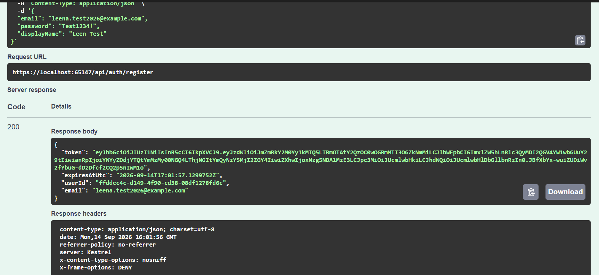
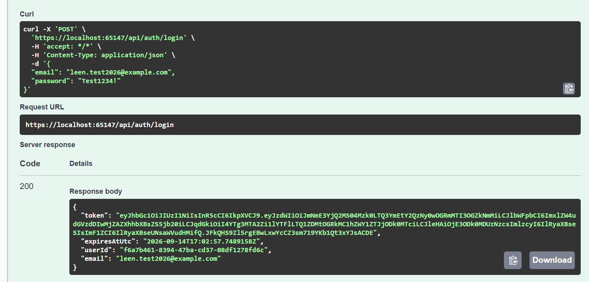
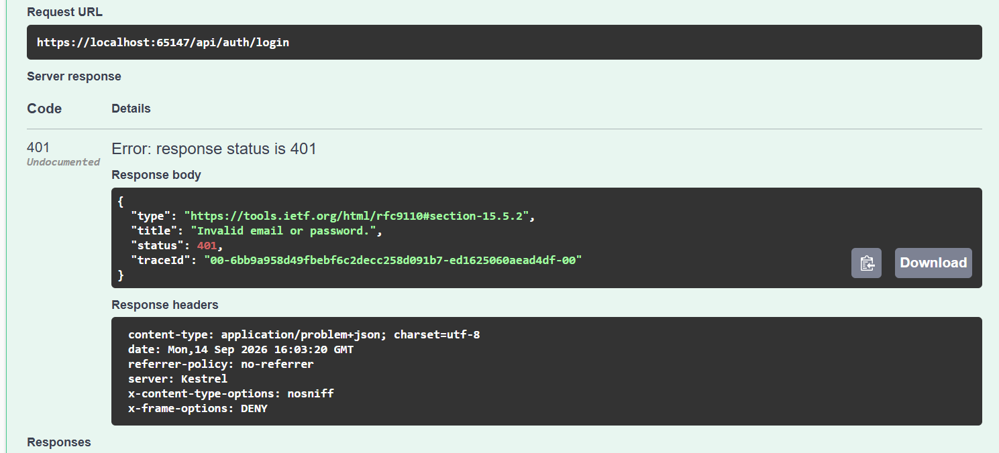
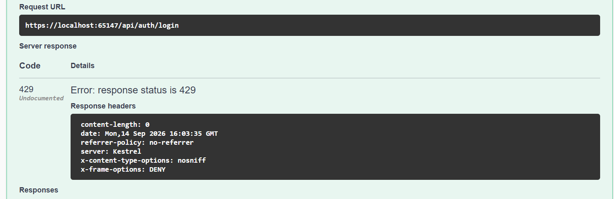
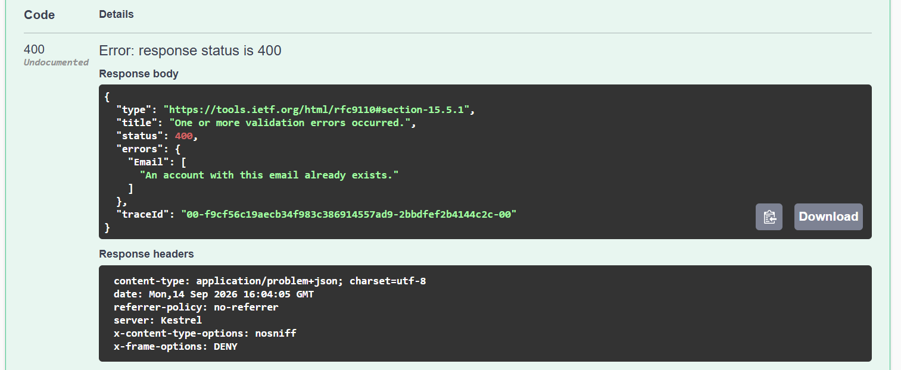
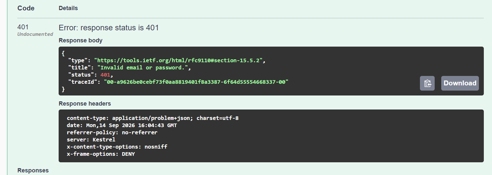
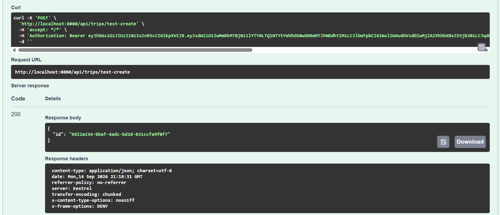
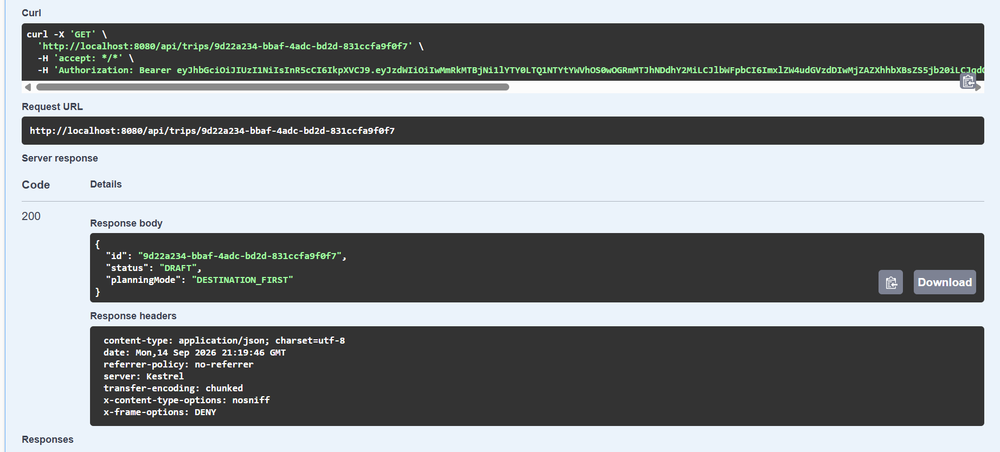
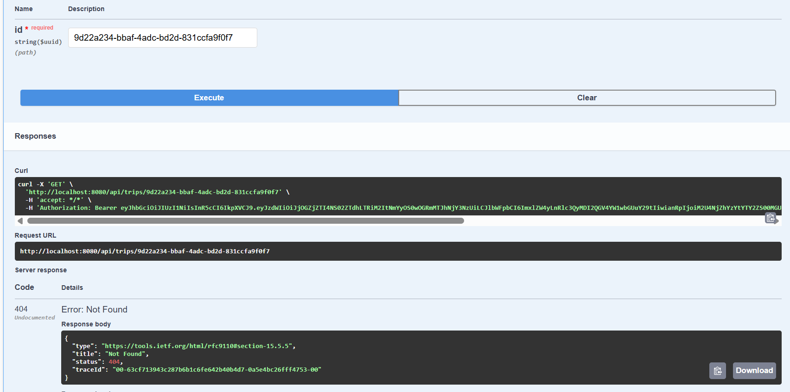
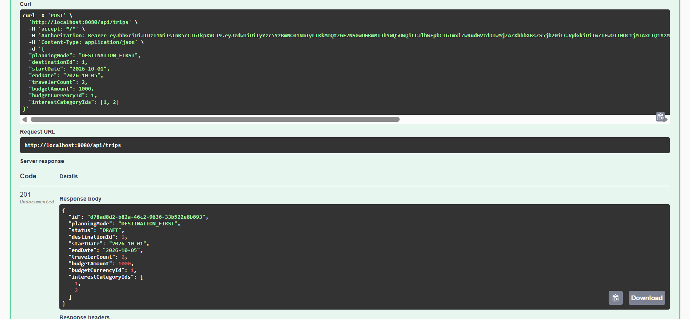

# Triply Backend

Triply is an AI-assisted trip-planning platform (mobile + web) that turns a user's destination or budget input into a personalized, day-by-day itinerary with a category-level cost breakdown.

This document tells the backend story **in the order it was actually built** — foundation → security → domain logic → lifecycle → concurrency → testing/CI → AI handoff. It is written to be walked through top-to-bottom in a mentor review.

For exact request/response payloads, see [`API Contract.md`](./API%20Contract.md).
For API design rules (naming, DTOs, error format, versioning), see [`API_CONVENTIONS.md`](./API_CONVENTIONS%20.md).

---


## 1. Project Goal

```text
User preferences
      ↓
Create trip
      ↓
Destination-first / Budget-first planning
      ↓
AI itinerary generation
      ↓
Validation against internal dataset
      ↓
Cost estimation
      ↓
User modification
      ↓
Save trip
      ↓
Retrieve / archive / restore
```

The backend is designed so that AI-generated content is **never accepted blindly**: every place referenced by a generated itinerary must exist in the internal, curated dataset before it is persisted. That guarantee is enforced at the database level (mandatory foreign key), not just in application code.

---

## 2. Design Principle Behind Every Decision

Every technical choice below — the modular monolith, the single Flutter codebase, who calls Gemini, which database, which testing tools — was made to match **demonstrated team capability**, not popularity. The same rule applies inside the backend itself: no feature was built beyond what the approved SRS/Architecture/Database Design documents require. If something wasn't in the approved schema (e.g. a direct Interest→Place relationship), it was **not invented** — see §7.

---

## 3. Technology Stack & Module Structure

- ASP.NET Core 9 / C# / .NET 9
- Entity Framework Core + SQL Server
- ASP.NET Core Identity + JWT Bearer Authentication
- FluentValidation
- Swagger / OpenAPI
- Docker / Docker Compose
- Redis (local infrastructure)
- xUnit / Moq / `WebApplicationFactory` integration tests
- GitHub Actions CI

```text
Triply.Api/
├── Common/
│   ├── Authorization/
│   └── Middleware/
├── Data/
├── Entities/
└── Modules/
    ├── Auth/
    ├── Trip/
    ├── Destination/
    ├── Cost/
    └── Itinerary/
```

| Module | Responsibility |
|---|---|
| Auth | Registration, login, JWT |
| Trip | Creation, retrieval, updates, lifecycle, ownership |
| Destination | Budget-first destination suggestions |
| Cost | Deterministic cost aggregation |
| Itinerary | Day/item persistence and validation |
| *(next)* AI integration | Gemini orchestration and AI-output validation |

---

## 4. Stage 1 — Backend Foundation

Before writing any feature, the project foundation was set up so it could actually run and be tested end to end:

- ASP.NET Core project setup, SQL Server + EF Core, migrations
- Docker Compose (API + SQL Server + Redis)
- Environment configuration via `.env` / `.env.example` — **no secrets in source control**
- Swagger, health endpoint, centralized exception-handling middleware
- API conventions agreed up front: `/api` base path, DTOs (never raw EF entities), `camelCase` JSON, `ProblemDetails` error format, UTC timestamps, `yyyy-MM-dd` dates

This foundation is the single source of truth for how Flutter and the backend communicate — see `API_CONVENTIONS.md`.

---

## 5. Stage 2 — Authentication & Security

```text
POST /api/auth/register   → returns a JWT immediately
POST /api/auth/login
```

**Tested cases:**

| Case | Result |
|---|---|
| Successful registration | `200` |
| Successful login | `200` |
| Wrong password | `401` (generic message — doesn't reveal which field was wrong) |
| Invalid / non-existing email | `401` |
| Duplicate email on register | `400` |
| Invalid registration data | `400` |
| Excessive login attempts | `429` (5 failed attempts / minute) |

JWT config: **60-minute lifetime**, issuer `Triply`, audience `TriplyClients`.

**Evidence:**
| Register success | Login success | Wrong password (401) |
|---|---|---|
|  |  |  |

| Rate limiting (429) | Duplicate email (400) | Invalid email (401) |
|---|---|---|
|  |  |  |

## 6. Stage 3 — Trip Management

Once a user is authenticated, the Trip domain was built:

- Authenticated trip creation, retrieval, and listing of a user's own trips
- Request validation: planning mode, traveler count, dates, budget, destination, interests
- Transaction handling on writes
- **Ownership protection** — a user can never see or modify another user's trip; unauthorized access returns `404`, not `403`, so trip existence isn't leaked

**Evidence:**
| Create trip | Get trip (authenticated) | Other user's trip blocked | Trip update |
|---|---|---|---|
|  |  |  |  |
---

## 7. Stage 4 — Budget-First Destination Suggestions

```text
POST /api/destinations/suggestions
```

Given a budget, currency, and interest categories, the service aggregates **active `Place` reference prices per destination** (from the real internal dataset) and returns destinations whose estimated aggregate cost fits the budget, sorted ascending by cost.

> **Important point to make to the mentor:** the approved database schema has no direct Interest → Place/Destination relationship. Rather than inventing a fake mapping to make the feature look "smarter," interest IDs are validated but budget matching is done purely against the real pricing dataset. This keeps AI/data logic honest instead of faking it — matches the project's core "no invented capability" rule.

Full request/response shape: see `API Contract.md` §5.

---

## 8. Stage 5 — Deterministic Cost Aggregation

```text
GET /api/trips/{tripId}/cost-estimate
```

```text
CostEstimates
      ↓
group by CostCategory (all configured categories included, even at 0.00)
      ↓
category totals
      ↓
grand total
      ↓
persisted to Trip.TotalEstimatedCost
```

A single currency is required before aggregation. Every figure returned is explicitly marked `"isEstimated": true` — never presented as a verified price.

---

## 9. Stage 6 — Itinerary Read/Write Scaffolding

```text
GET  /api/trips/{tripId}/itinerary
POST /api/trips/{tripId}/itinerary
```

```text
Itinerary
 └── Days (dayNumber, date)
      └── Items (place, timeSlot, orderIndex, estimatedCost, notes, isAiGenerated)
```

Validation: unique/positive day numbers, valid time slots, non-negative cost and order index, place must exist, be active, and (when the trip has a destination) belong to that destination. The write is an **atomic replacement** of the current itinerary.

> **Say this explicitly:** this stage is a persistence/validation scaffold built *ahead of* AI integration — it does not call an LLM. It exists so the AI team has a working, validated contract to write into once Gemini is connected.

---

## 10. Stage 7 — Trip Save, Retrieve & Lifecycle

```text
DRAFT → GENERATING → GENERATED → MODIFIED → SAVED → ARCHIVED
                 ↘ (validation failure) → DRAFT (retry)
```

```text
POST /api/trips/{id}/generate
POST /api/trips/{id}/save
POST /api/trips/{id}/archive
POST /api/trips/{id}/restore
GET  /api/trips/{id}       → trip + itinerary + cost estimate, in one response
```

> **Important point:** there is no generic "set status" endpoint that lets a client jump to any status directly. Status only changes as the *result* of a specific business action (generate, save, archive, restore) — this prevents clients from putting a trip into an invalid state.

---

## 11. Stage 8 — Optimistic Concurrency *(most recent work)*

`Trip.Version` is an EF Core concurrency token. Every update carries an `expectedVersion`:

```json
{ "expectedVersion": 1 }
```

```text
expectedVersion  vs  current Trip.Version
        ↓ mismatch
     409 Conflict   (instead of silently overwriting a newer save)
```

**Integration test scenario:**

```text
Request A: version 1 → success → version becomes 2
Request B: still sends expectedVersion = 1 → 409 Conflict
```

Latest commit on this feature: `3153892`.

---

## 12. Testing

Integration tests via `WebApplicationFactory` cover: authentication, authorization/ownership, validation, destination suggestions, cost aggregation, itinerary persistence, trip lifecycle, concurrency conflicts, and rate limiting.

**Latest local run before the AI handoff:**

```text
51 tests — 0 failed — 51 succeeded
```

---

## 13. Docker

```text
triply-api        → 8080
triply-sqlserver   → 1433
redis-local        → 6379
```

```powershell
docker compose down
docker compose up -d --build
docker compose ps
```

Health: `http://localhost:8080/health` · Swagger: `http://localhost:8080/swagger`

---

## 14. CI/CD & Git Workflow

GitHub Actions builds the backend and runs the integration test suite (against the same SQL Server test environment) on every push — changes are verified before merge.

Work happens on `backend/feat/api-conventions`, in focused feature commits reviewed via PR:

```text
115818b  feat: implement budget-first destination suggestions
de7c818  feat: implement deterministic cost aggregation
6b4ff0e  feat: implement itinerary read write scaffolding
60a122d  feat: implement trip save retrieve and status lifecycle
3153892  feat: implement optimistic trip concurrency
```

---

## 15. What's Next — AI Integration Handoff

The backend is now at a **stable handoff point**. Non-AI trip functionality is implemented and tested; the next dependency is the AI team's finalized prompt/JSON-schema/validation contract.

```text
Flutter
   ↓
Backend trip request
   ↓
Candidate places / pricing (from internal dataset)
   ↓
Gemini
   ↓
Structured JSON
   ↓
Schema validation
   ↓
Internal Place/Dataset validation  ← rejects/regenerates, never fabricates
   ↓
Persist itinerary
   ↓
Cost aggregation
   ↓
Update trip lifecycle/version
   ↓
Flutter (labeled "Estimated")
```

Remaining backend work once the AI contract lands:

1. Integrate the finalized Gemini contract
2. Bounded generation/retry handling
3. Validate AI JSON against the agreed schema
4. Validate generated places against the internal dataset
5. Persist AI generation results
6. Connect generation to the existing trip lifecycle
7. Partial itinerary regeneration
8. Additional integration/edge-case tests
9. Final API contract + Swagger updates
10. Backend hardening & deployment prep

*(Conversational/multi-turn refinement is Post-MVP by design — not a gap in the current backend.)*

---

## 16. Current Status Summary

```text
Backend foundation → Core trip APIs → AI handoff → Gemini integration
       → AI validation → Generation + regeneration → Final integration
```

**Completed:** foundation, Docker, SQL Server/EF Core, migrations, API conventions, Swagger, exception handling, auth, JWT, rate limiting, ownership authorization, trip management, budget-first suggestions, deterministic cost aggregation, itinerary persistence scaffolding, trip save/retrieve, trip lifecycle, optimistic concurrency, integration testing, CI.

**Not yet started:** live Gemini integration (blocked on AI team's contract).

---

## 17. Related Documents

- [`API Contract.md`](./API%20Contract.md) — exact request/response JSON for every endpoint
- [`API_CONVENTIONS .md`](./API_CONVENTIONS%20.md) — naming, DTO, error-format, and versioning rules
