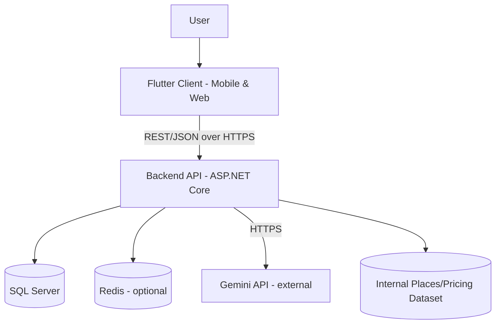
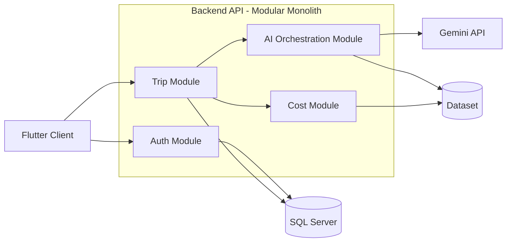
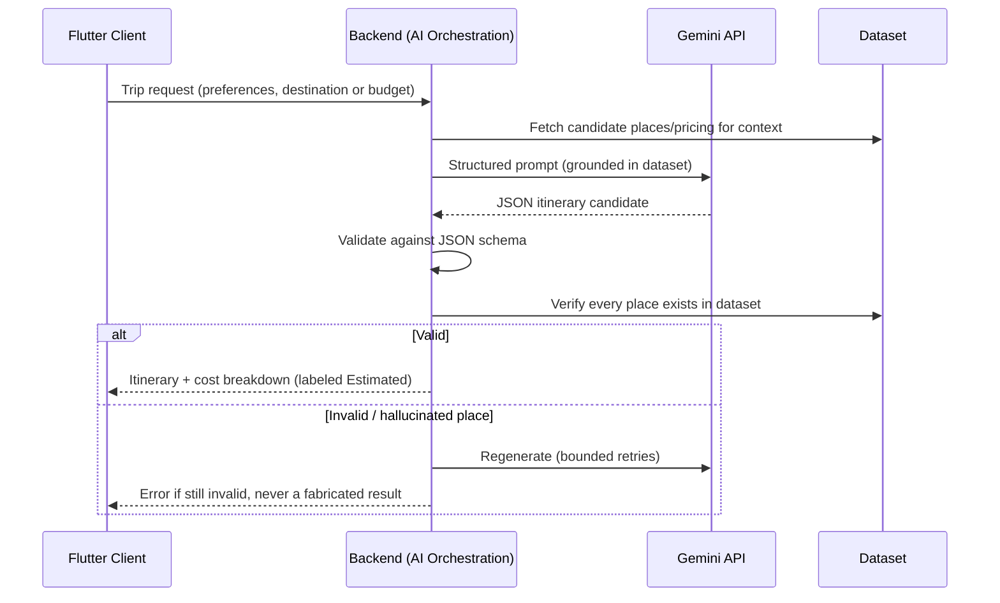

# TRIPLY — SYSTEM ARCHITECTURE

## 1. Architecture Overview

Triply is built as a **modular monolith**: one ASP.NET Core Web API service, organized into clear internal modules (Auth, Trips, AI-Orchestration, Cost, Dataset), backed by one SQL Server database. Clients are a **single Flutter codebase** compiled for mobile (iOS/Android) and Web.

## 2. Architectural Principles
- Choose the simplest architecture the team can fully own — not the most fashionable one.
- One primary owner per component (see Document 4).
- Clients hold no business logic that belongs to the backend.
- The AI subsystem never owns persisted application state.
- AI-generated content is always distinguishable from verified system data.

## 3. Architecture Style Decision (ADR-00)
**Decision:** Modular monolith, not microservices.
**Rationale:** No track has microservices or distributed-systems experience (Backend gap list, explicit). A single well-structured service satisfies MVP scale, is testable with the team's demonstrated tools (xUnit/WebApplicationFactory), and avoids operational complexity (service discovery, distributed tracing) nobody on the team has practiced.
**Revisit when:** Traffic/team size grows enough to justify the added operational cost.

## 4. ADR-01 — Who Calls Gemini
**Decision:** The **Backend module** makes the live HTTPS call to the Gemini API. The **AI track** owns prompt design, the JSON output schema, and the post-generation validation rules (as code/config), which Backend integrates.
**Rationale:** Backend has demonstrated REST/HTTP client and API-consumption experience; the AI track's own capability summary confirms no REST-API-consumption training exists yet, and recommends exactly this split.
**Consequence:** AI-track members work closely with Backend during Phase 6 to translate validated prompt templates into backend-executable configuration — not into a separately deployed AI service.

## 5. ADR-02 — One Codebase for Mobile and Web
**Decision:** Use Flutter's Web target to deliver the "web platform" requirement, from the same codebase Dana already owns, rather than standing up a separate web frontend stack.
**Rationale:** No team member has demonstrated web-frontend (React/Angular/etc.) capability; a second frontend stack would require an unstaffed skillset. Flutter Web reuses 100% of the Flutter track's demonstrated UI, state, and API-integration skill.
**Trade-off (documented, not hidden):** Flutter Web has known limitations for SEO and very large-scale desktop-grade UI polish — acceptable for MVP scope.

## 6. Major Components & Responsibilities

| Component | Responsibility | Primary Owner |
|---|---|---|
| Flutter Client (Mobile + Web) | UI, navigation, client-side validation, session/state, calling backend API | Dana Yaseen |
| Backend API — Auth module | Registration, login, JWT issuance, RBAC/ownership checks | Lynn Sharbati |
| Backend API — Trip module | Trip CRUD, orchestrating destination-first/budget-first flows | Lynn Sharbati |
| Backend API — AI-Orchestration module | Calls Gemini, applies AI track's validation rules, returns schema-checked result | Lynn Sharbati (integration) + AI track (logic/rules) |
| Backend API — Cost module | Deterministic cost aggregation/breakdown by category | Lynn Sharbati |
| Dataset (Places/Pricing) | Curated internal source of truth | AI track (Aya, Anas, Adam) |
| SQL Server | Persisted data: users, trips, dataset | Lynn Sharbati |
| Redis (optional) | Cache-aside for hot read paths, added only if performance work is triggered | Lynn Sharbati |
| Gemini API (external) | LLM itinerary/destination generation | External — invoked by Backend |

## 7. Context Diagram

## 8. Component Diagram

## 9. AI Generation Lifecycle

## 10. Request Lifecycle (standard CRUD)
Client → JWT-authenticated request → Backend controller → FluentValidation → module logic → EF Core → SQL Server → response DTO → client. Matches the pattern the Backend track built and tested during its capstone sprints.

## 11. Authentication & Authorization Architecture
ASP.NET Core Identity issues JWT bearer tokens. Role-based authorization for coarse access; ownership-based authorization at the resource level (a user can only access their own trips) — this exact pattern was built and tested in the Backend track's Sprint 2.

## 12. Security Boundaries
Backend is the only component with database and Gemini API credentials. Flutter clients hold only a short-lived JWT. Rate limiting and CORS are enforced at the backend edge. Anything beyond this (secrets vaulting, WAF, pen-testing) is **not currently owned by any track** — flagged, not silently skipped.

## 13. Data Architecture
Relational schema (SQL Server) — Users, Trips, ItineraryDays, ItineraryItems, Destinations, Places, PricingReference, InterestCategories. Normalized per the Backend track's demonstrated 1NF–3NF practice.

## 14. Error Handling & Observability
Centralized `ProblemDetails` error responses (demonstrated backend pattern). Logging via built-in `ILogger` + EF Core query logs. No centralized logging/monitoring stack (ELK/Application Insights/Grafana) is evidenced on the team — **TBD**, add as a post-MVP investment if operational visibility becomes a problem.

## 15. Deployment Considerations
**Unresolved (Decision Required):** no team member has evidenced cloud hosting, containerization, or CI/CD experience. The Backend track's own gap analysis explicitly flags this as "planned but not yet covered." Recommend: start with the simplest viable hosting option (a single managed app-hosting environment for the API + a managed SQL instance) and treat CI/CD as a learning objective for Phase 11, not an assumed capability.

## 16. Scalability Considerations
MVP scale does not require more than the modular monolith + Redis cache-aside pattern the Backend track already demonstrated (N+1 fixes, composite indexing, caching). Horizontal scaling / microservices are explicitly deferred (see ADR-00).

## 17. Technology Selection Rationale
Every technology choice below is justified by **demonstrated team capability**, not popularity:

| Layer | Technology | Why |
|---|---|---|
| Backend | ASP.NET Core Web API + EF Core + SQL Server | Backend track's evidenced, capstone-tested stack |
| Auth | ASP.NET Core Identity + JWT | Practiced and tested in Sprint 2 |
| Caching | Redis (cache-aside) | Practiced in Sprint 3 |
| Client | Flutter (mobile + web) | Flutter track's evidenced, capstone-tested stack |
| AI | Gemini API + prompt engineering | Project's own scoping decision; requires AI-track upskilling (flagged, not hidden) |
| Data validation | FluentValidation | Backend track's demonstrated tool |
| Testing | xUnit/Moq/WebApplicationFactory (backend), Flutter widget tests | Matches each track's demonstrated testing tools |

## 18. Architectural Risks
See Document 1 §12 and Document 4 §Risk Ownership for the full register. Top architectural risks: (1) no deployment/CI-CD capability yet on any track, (2) AI track needs upskilling before Phase 6 can start, (3) Gemini API cost/rate-limit dependency, (4) no dedicated web-frontend or cybersecurity specialist.

## 19. Architecture Assumptions
- Gemini API remains the chosen LLM provider through MVP.
- Dataset size stays within what a small, curated internal source can reasonably maintain (bounded destination list).
- No requirement emerges for real-time features (chat/live tracking) that would force an event-driven architecture change.

## 20. Future Evolution Path
If scale or team size grows: (a) split AI-orchestration into its own service once the AI track has REST/deployment experience, (b) introduce a proper web frontend if Flutter Web's limitations become blocking, (c) introduce CI/CD and a centralized logging stack as the team's DevOps capability matures.
