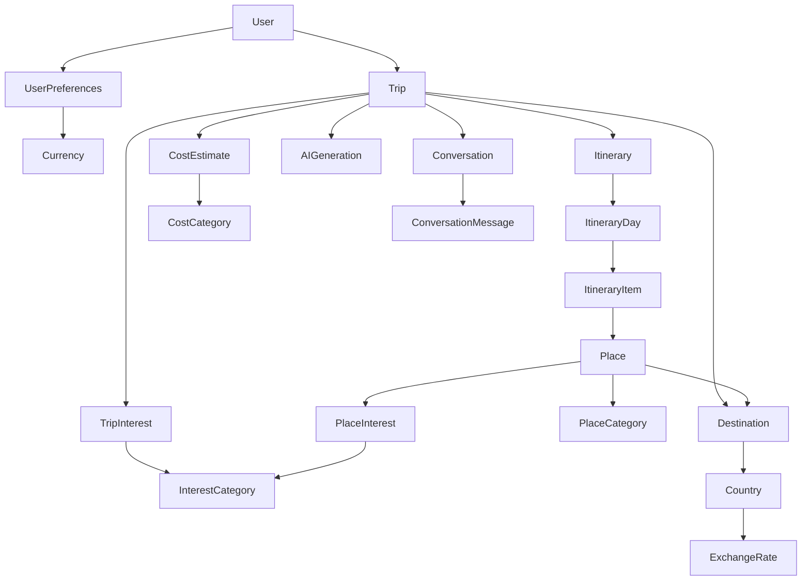
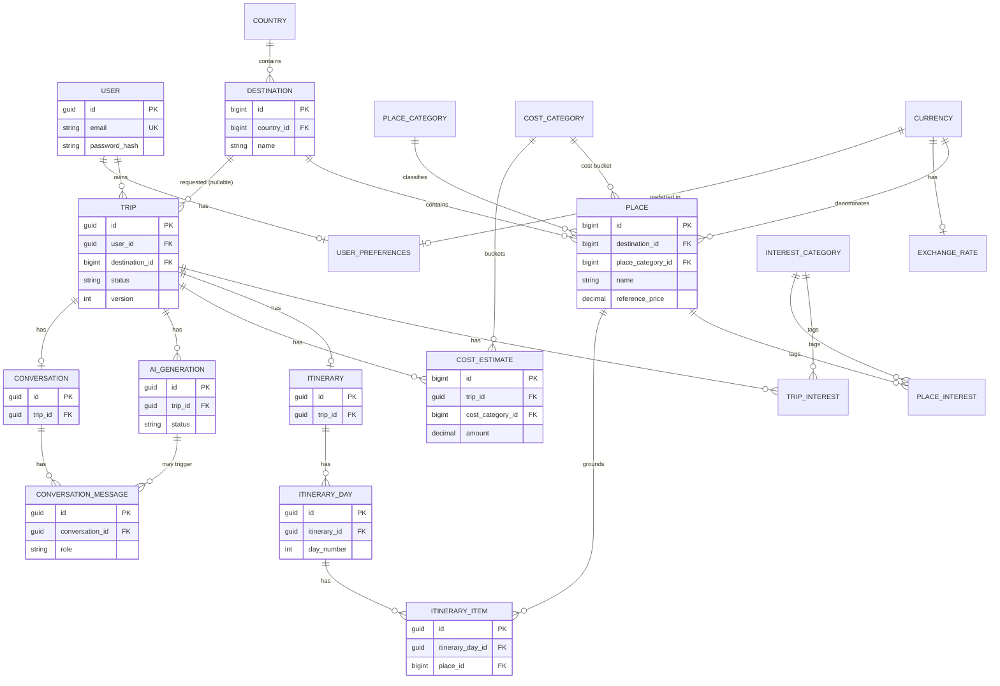

# TRIPLY — DATABASE DESIGN & DATA MODEL SPECIFICATION

*Derived strictly from the approved SRS, System Architecture, and Team & Responsibilities documents. No entity below exists without a traceable requirement or architectural need.*

> **Reconciled with the implemented schema.** This document now matches
> `Backend/Triply.Api` (`ApplicationDbContext`, entity classes and the EF Core
> migration history). Where the implemented schema and this specification once
> diverged, the code is the source of truth and the text below was brought in
> line with it; such passages are called out explicitly ("implemented",
> "designed, not created").

---

## 1. Executive Summary

Triply's data model is a **relational schema on SQL Server**, accessed via EF Core — matching the Backend track's demonstrated, capstone-tested stack (per Team & Responsibilities). The current EF model has **18 application-owned tables/sets**, plus the seven ASP.NET Core Identity tables (including `AspNetUsers` for the logical `User` entity). The model has no speculative audit infrastructure or entities invented from "typical travel app" patterns. Four application tables added by later implementation (`PlaceInterests`, `UserPreferences`, `ExchangeRates`, and `RefreshTokens`) are documented below with their provenance; two designed Post-MVP tables (`Conversation`, `ConversationMessage`) are **not yet created**.

Three design decisions shape everything below:
1. **AI-generated content is structurally forced to reference only real internal data** — every `ItineraryItem` has a mandatory, non-nullable foreign key to `Place`. This makes the project's non-negotiable 0%-invented-places rule (FR-AI-002) a database-level guarantee, not just an application-level check.
2. **Pricing is embedded in `Place`, not a separate pricing table** — a place has one canonical reference price band, so a `PriceReference` table would be an unjustified extra join (Phase 14 guidance against unnecessary normalization).
3. **No trip/itinerary versioning table** — nothing in the SRS requires history/rollback of past plans; FR-TRIP-003 (partial regeneration) only needs the current state to be mutable, so a simple `version` counter is used instead of a history table. If this changes, it's flagged in Open Questions (§29).

## 2. Database Design Goals
- Every persistent requirement in the SRS has an unambiguous table/column representation.
- AI-generated data is structurally distinguishable from user data and from verified/deterministic system data (SRS §8).
- No entity exists without a cited source requirement (§5).
- Identifiers chosen for security and scale, not by default habit (§ Primary Keys, below).
- Normalized to 3NF except where denormalization is explicitly justified (§15).
- Implementable end-to-end by the Backend track's demonstrated EF Core/SQL Server skillset — no exotic database technology.

## 3. Domain Model Overview



*(Implemented solid lines plus the designed-but-not-created `Conversation` branch — see §4.)*

## 4. Entity Inventory

| # | Entity | Type | MVP or Post-MVP |
|---|---|---|---|
| 1 | User | Persistent — core | MVP |
| 2 | Country | Reference | MVP |
| 3 | Destination | Persistent — core | MVP |
| 4 | PlaceCategory | Reference | MVP |
| 5 | Place | Persistent — core (internal dataset) | MVP |
| 6 | CostCategory | Reference | MVP |
| 7 | Currency | Reference | MVP |
| 8 | InterestCategory | Reference | MVP |
| 9 | Trip | Persistent — core | MVP |
| 10 | TripInterest | Junction | MVP |
| 11 | Itinerary | Persistent — core | MVP |
| 12 | ItineraryDay | Persistent — core | MVP |
| 13 | ItineraryItem | Persistent — core | MVP |
| 14 | CostEstimate | Persistent — core | MVP |
| 15 | AIGeneration | Persistent — AI-related | MVP |
| 16 | Conversation | Persistent — supporting | Post-MVP (FR-TRIP-005) — *designed, not created* |
| 17 | ConversationMessage | Persistent — supporting | Post-MVP (FR-TRIP-005) — *designed, not created* |
| 18 | PlaceInterest | Junction | MVP |
| 19 | UserPreferences | Persistent — supporting | MVP |
| 20 | ExchangeRate | Reference | MVP |
| 21 | RefreshToken | Persistent — authentication support | MVP |

**Implemented-schema reconciliation:** items 1–15 and 18–21 exist in the current EF model. `User` is the logical entity implemented by Identity's `AspNetUsers`; `ApplicationDbContext` exposes 18 application-owned `DbSet`s/tables, including `RefreshTokens`. Identity creates seven framework tables in total, including `AspNetUsers`. Items 16–17 exist only as designs until FR-TRIP-005 is built. Items 18–20 were added by `AddPlaceInterest`, `AddUserPreferencesAndTripMetadata`, and `AddExchangeRates`; item 21 was added by `AddRefreshTokens`.

Entities explicitly **not created**, with reasons:
- **UserProfile** — no requirement for saved default preferences separate from a trip's own preferences; would be speculative.
- **SavedTrip** — "saving" a trip is a `Trip.status` value, not a separate entity (FR-TRIP-004 doesn't describe distinct saved-trip semantics beyond persistence + retrieval).
- **City** (separate from Destination) — no requirement needs city-level granularity independent of the "supported destination" concept.
- **PriceReference** (separate from Place) — merged into `Place` (see Executive Summary decision #2).
- **AuditLog** — SRS's observability requirement (NFR-OBS-001) only asks for `ILogger`-level logging, not a database audit trail; flagged as an open question if compliance needs grow.
- **ExternalDataSource** — architecture confirms no live external pricing/data feed exists yet (Architecture §15); nothing to reference.

## 5. Entity Justification

| Entity | Purpose | Source Requirement | Owner | Core/Supporting |
|---|---|---|---|---|
| User | Authentication identity and ownership root for all trip data | FR-AUTH-001/002, NFR-PRIV-001 | Backend | Core |
| Country | Normalizes destination geography, avoids repeating country names | FR-TRIP-001/002 (destination data) | AI track (dataset) | Reference |
| Destination | The unit a user plans a trip to/receives suggestions for | FR-TRIP-001, FR-TRIP-002 | AI track (dataset) | Core |
| PlaceCategory | Classifies places (attraction, restaurant, activity, accommodation, transport) for filtering and AI grounding | FR-AI-001, FR-DATA-001 | AI track | Reference |
| Place | The internal, curated ground-truth every AI-generated item must reference | FR-AI-002 (0% invented places), FR-DATA-001 | AI track | Core |
| CostCategory | Fixed cost buckets for FR-COST-001's breakdown | FR-COST-001 | Backend | Reference |
| Currency | Supports currency handling per trip | SRS §2 constraints (currency handling) | Backend | Reference |
| InterestCategory | Fixed interest list (nature, history, food, shopping, adventure, culture, relaxation, other) | Master Plan §3 project goals | Backend | Reference |
| Trip | The central planning request/record — the anchor for everything else | FR-TRIP-001–004 | Backend | Core |
| TripInterest | Resolves the Trip↔InterestCategory many-to-many | FR-TRIP-001/002 | Backend | Junction |
| Itinerary | Container for the generated day-by-day plan, separate from the Trip request itself | FR-AI-001, FR-TRIP-003 | Backend | Core |
| ItineraryDay | Represents one day of the plan | FR-AI-001 (day-by-day) | Backend | Core |
| ItineraryItem | Represents one activity/meal/transport/accommodation entry in a day | FR-AI-001, FR-TRIP-003 | Backend | Core |
| CostEstimate | Persists the category-level cost breakdown | FR-COST-001 | Backend | Core |
| AIGeneration | Records each generation attempt, its validation outcome, and status — makes FR-AI-002 auditable | FR-AI-001, FR-AI-002 | Backend (integration) + AI (rules) | Core |
| Conversation | Anchors multi-turn refinement to a trip, if/when built | FR-TRIP-005 (Should) | Backend | Supporting — *designed, not created* |
| ConversationMessage | Individual turns within a conversation | FR-TRIP-005 (Should) | Backend | Supporting — *designed, not created* |
| PlaceInterest | Interest tags on curated places, used by interest-aware destination suggestions | FR-TRIP-002 (budget/preferences matching), FR-DATA-001 | AI track (dataset) | Junction |
| UserPreferences | Server-side profile-level preferences (distance unit, pacing, preferred currency) persisted across devices/sessions | Backend implementation detail supporting preference capture in FR-TRIP-001/002 — no distinct SRS FR (added by migration `AddUserPreferencesAndTripMetadata`) | Backend | Supporting |
| ExchangeRate | USD-relative rate per currency so budget and cost figures convert consistently | FR-COST-001 + FR-TRIP-002 (currency conversion across cost/suggestion flows) | Backend | Reference |

## 6. Detailed Entity Specifications

> Identifier legend: `GUID` = user/API-facing entity (see §7 rationale). `BIGINT IDENTITY` = internal/reference entity.

### 6.1 User
| Attribute | Type | Null | Default | Notes |
|---|---|---|---|---|
| id | GUID | NOT NULL | system-generated | PK |
| email | VARCHAR(256) | NOT NULL | — | UNIQUE, authentication identifier, sensitive |
| password_hash | VARCHAR(512) | NOT NULL | — | Provided by ASP.NET Core Identity, sensitive, never plaintext |
| display_name | VARCHAR(100) | NULL | — | User-editable |
| created_at | TIMESTAMP | NOT NULL | now() | system-generated |
| deleted_at | TIMESTAMP | NULL | — | soft-delete marker (see §15) |

> **Implemented as:** ASP.NET Core Identity's `AspNetUsers` table (entity
> `ApplicationUser : IdentityUser<Guid>`), plus framework-owned `AspNetRoles`,
> `AspNetUserRoles`, `AspNetUserClaims`, `AspNetRoleClaims`, `AspNetUserLogins`
> and `AspNetUserTokens`. Column mapping: `email` → `Email` (nvarchar(256),
> uniqueness enforced by the unique filtered index `EmailIndex` on
> `NormalizedEmail`), `password_hash` → `PasswordHash` (Identity PBKDF2, not a
> plain VARCHAR), `display_name` → `DisplayName` (nvarchar(100)),
> `created_at`/`deleted_at` → `CreatedAt`/`DeletedAt`. Identity additionally
> stores `UserName`, `Normalized*` columns, security/concurrency stamps and
> lockout/2FA columns — framework-owned, not owned by this specification.

### 6.2 Country (reference)
| Attribute | Type | Null | Notes |
|---|---|---|---|
| id | BIGINT IDENTITY | NOT NULL | PK |
| name | VARCHAR(100) | NOT NULL | UNIQUE |
| iso_code | CHAR(2) | NOT NULL | UNIQUE, e.g. "JO", "IT" |

### 6.3 Destination
| Attribute | Type | Null | Notes |
|---|---|---|---|
| id | BIGINT IDENTITY | NOT NULL | PK |
| country_id | BIGINT | NOT NULL | FK → Country |
| name | VARCHAR(150) | NOT NULL | e.g. "Petra", "Rome" |
| description | TEXT | NULL | AI-grounding context |
| latitude | DECIMAL(9,6) | NULL | |
| longitude | DECIMAL(9,6) | NULL | |
| is_supported | BOOLEAN | NOT NULL | default true; controls whether the destination is offered (D5 in SRS) |

### 6.4 PlaceCategory (reference)
| Attribute | Type | Null | Notes |
|---|---|---|---|
| id | BIGINT IDENTITY | NOT NULL | PK |
| code | VARCHAR(30) | NOT NULL | UNIQUE, e.g. `ATTRACTION`, `RESTAURANT`, `ACTIVITY`, `ACCOMMODATION`, `TRANSPORT` |
| label | VARCHAR(60) | NOT NULL | display label |

### 6.5 Place
| Attribute | Type | Null | Default | Notes |
|---|---|---|---|---|
| id | BIGINT IDENTITY | NOT NULL | — | PK |
| destination_id | BIGINT | NOT NULL | — | FK → Destination, indexed |
| place_category_id | BIGINT | NOT NULL | — | FK → PlaceCategory |
| name | VARCHAR(200) | NOT NULL | — | curated place/activity name — **this is the value AI output is validated against** |
| description | TEXT | NULL | — | AI-grounding context |
| reference_price | DECIMAL(10,2) | NOT NULL | — | canonical estimated price, per unit (see cost model) |
| currency_id | BIGINT | NOT NULL | — | FK → Currency |
| cost_category_id | BIGINT | NOT NULL | — | FK → CostCategory, which bucket this place's cost rolls into |
| price_updated_at | TIMESTAMP | NOT NULL | now() | data-freshness marker |
| is_active | BOOLEAN | NOT NULL | true | soft-disable without breaking historical itinerary references |

### 6.6 CostCategory (reference)
| Attribute | Type | Null | Notes |
|---|---|---|---|
| id | BIGINT IDENTITY | NOT NULL | PK |
| code | VARCHAR(30) | NOT NULL | UNIQUE — `ACCOMMODATION`, `TRANSPORTATION`, `FOOD`, `ACTIVITIES`, `OTHER` |
| label | VARCHAR(60) | NOT NULL | display label |

### 6.7 Currency (reference)
| Attribute | Type | Null | Notes |
|---|---|---|---|
| id | BIGINT IDENTITY | NOT NULL | PK |
| iso_code | CHAR(3) | NOT NULL | UNIQUE, e.g. "USD", "JOD" |
| symbol | VARCHAR(5) | NOT NULL | e.g. "$" |

### 6.8 InterestCategory (reference)
| Attribute | Type | Null | Notes |
|---|---|---|---|
| id | BIGINT IDENTITY | NOT NULL | PK |
| code | VARCHAR(30) | NOT NULL | UNIQUE — `NATURE`, `HISTORY`, `FOOD`, `SHOPPING`, `ADVENTURE`, `CULTURE`, `RELAXATION`, `OTHER` |
| label | VARCHAR(60) | NOT NULL | display label |

### 6.9 Trip
| Attribute | Type | Null | Default | Notes |
|---|---|---|---|---|
| id | GUID | NOT NULL | — | PK |
| user_id | GUID | NOT NULL | — | FK → User, indexed, ownership-based authorization root |
| destination_id | BIGINT | NULL | — | FK → Destination; NULL while budget-first flow hasn't selected one yet |
| planning_mode | VARCHAR(20) | NOT NULL | — | CHECK IN (`DESTINATION_FIRST`,`BUDGET_FIRST`) |
| status | VARCHAR(20) | NOT NULL | `DRAFT` | CHECK IN (`DRAFT`,`GENERATING`,`GENERATED`,`MODIFIED`,`SAVED`,`ARCHIVED`) — see §19 lifecycle |
| start_date | DATE | NULL | — | required once destination confirmed |
| end_date | DATE | NULL | — | |
| traveler_count | INT | NOT NULL | 1 | CHECK > 0 |
| budget_amount | DECIMAL(10,2) | NULL | — | required for budget-first mode |
| budget_currency_id | BIGINT | NULL | — | FK → Currency |
| title | VARCHAR(200) | NULL | — | user-editable trip title (added by migration `AddUserPreferencesAndTripMetadata`) |
| cover_image_url | VARCHAR(1000) | NULL | — | optional trip cover image (same migration) |
| total_estimated_cost | DECIMAL(10,2) | NULL | — | **denormalized cache** of sum(CostEstimate.amount), see §15 |
| version | INT | NOT NULL | 1 | optimistic concurrency counter, increments on regeneration/edit |
| created_at | TIMESTAMP | NOT NULL | now() | |
| updated_at | TIMESTAMP | NOT NULL | now() | |
| deleted_at | TIMESTAMP | NULL | — | soft-delete (FLOW 12) |

### 6.10 TripInterest (junction)
| Attribute | Type | Null | Notes |
|---|---|---|---|
| trip_id | GUID | NOT NULL | FK → Trip, part of composite PK |
| interest_category_id | BIGINT | NOT NULL | FK → InterestCategory, part of composite PK |
| — | — | — | PK (trip_id, interest_category_id); UNIQUE by definition of composite PK |

### 6.11 Itinerary
| Attribute | Type | Null | Notes |
|---|---|---|---|
| id | GUID | NOT NULL | PK |
| trip_id | GUID | NOT NULL | FK → Trip, UNIQUE (1:1) |
| generated_at | TIMESTAMP | NOT NULL | when the current version was produced |
| ai_generation_id | GUID | NULL | — | Marker of the AIGeneration that produced the current content. **Implemented as a plain nullable column: no FK constraint is configured today** (AIGeneration rows cascade with the trip regardless); listed as an FK-by-design here so Post-MVP work can add it deliberately |

### 6.12 ItineraryDay
| Attribute | Type | Null | Notes |
|---|---|---|---|
| id | GUID | NOT NULL | PK |
| itinerary_id | GUID | NOT NULL | FK → Itinerary, indexed |
| day_number | INT | NOT NULL | CHECK > 0 |
| date | DATE | NOT NULL | |
| — | — | — | UNIQUE (itinerary_id, day_number) |

### 6.13 ItineraryItem
| Attribute | Type | Null | Default | Notes |
|---|---|---|---|---|
| id | GUID | NOT NULL | — | PK |
| itinerary_day_id | GUID | NOT NULL | — | FK → ItineraryDay, indexed |
| place_id | BIGINT | **NOT NULL** | — | FK → Place — **mandatory; this is the FR-AI-002 enforcement point** |
| time_slot | VARCHAR(20) | NOT NULL | — | CHECK IN (`MORNING`,`AFTERNOON`,`EVENING`) |
| order_index | INT | NOT NULL | — | ordering within the time slot |
| estimated_cost | DECIMAL(10,2) | NOT NULL | — | copied from Place.reference_price at generation time (see §15 denormalization) |
| notes | TEXT | NULL | — | user-editable |
| is_ai_generated | BOOLEAN | NOT NULL | true | false once a user manually edits this item |
| modified_at | TIMESTAMP | NULL | — | set when user edits |

### 6.14 CostEstimate
| Attribute | Type | Null | Notes |
|---|---|---|---|
| id | BIGINT IDENTITY | NOT NULL | PK |
| trip_id | GUID | NOT NULL | FK → Trip, indexed |
| cost_category_id | BIGINT | NOT NULL | FK → CostCategory |
| amount | DECIMAL(10,2) | NOT NULL | CHECK >= 0 |
| currency_id | BIGINT | NOT NULL | FK → Currency |
| computed_at | TIMESTAMP | NOT NULL | now() |
| — | — | — | UNIQUE (trip_id, cost_category_id) — one row per category per trip |

### 6.15 AIGeneration
| Attribute | Type | Null | Notes |
|---|---|---|---|
| id | GUID | NOT NULL | PK |
| trip_id | GUID | NOT NULL | FK → Trip, indexed |
| attempt_number | INT | NOT NULL | 1, 2, 3… for regeneration/retry tracking |
| model_provider | NVARCHAR(MAX) | NOT NULL | Stores the configured model identifier (default `gemini-3.6-flash`), despite the legacy column name |
| input_snapshot | JSON | NOT NULL | preferences/budget/destination sent to the model — **not** the raw prompt text |
| raw_output | JSON | NULL | model's structured response; **retention-limited, see §16** |
| status | VARCHAR(20) | NOT NULL | CHECK IN (`PENDING`,`SUCCEEDED`,`FAILED_VALIDATION`,`FAILED_ERROR`) |
| validation_errors | TEXT | NULL | populated only when status is a failure |
| requested_at | TIMESTAMP | NOT NULL | now() |
| completed_at | TIMESTAMP | NULL | |

**Provenance gap:** this implemented table does not currently persist the AI schema version used for an attempt. The AI contract requires that value; add and populate a schema-version column before describing schema provenance as implemented (see AI JSON Schema Contract §8).

### 6.16 Conversation *(Post-MVP)*
| Attribute | Type | Null | Notes |
|---|---|---|---|
| id | GUID | NOT NULL | PK |
| trip_id | GUID | NOT NULL | FK → Trip, UNIQUE (1:1) — conversation belongs to a trip, which belongs to a user |
| created_at | TIMESTAMP | NOT NULL | now() |

### 6.17 ConversationMessage *(Post-MVP)*
| Attribute | Type | Null | Notes |
|---|---|---|---|
| id | GUID | NOT NULL | PK |
| conversation_id | GUID | NOT NULL | FK → Conversation, indexed |
| role | VARCHAR(10) | NOT NULL | CHECK IN (`USER`,`AI`) |
| content | TEXT | NOT NULL | |
| related_ai_generation_id | GUID | NULL | FK → AIGeneration, if the message triggered a regeneration |
| created_at | TIMESTAMP | NOT NULL | now() |

### 6.18 PlaceInterest *(junction — implemented)*
| Attribute | Type | Null | Notes |
|---|---|---|---|
| place_id | BIGINT | NOT NULL | part of composite PK, FK → Place, ON DELETE CASCADE |
| interest_category_id | BIGINT | NOT NULL | part of composite PK, FK → InterestCategory, ON DELETE RESTRICT; secondary index |

Resolves the Place ↔ InterestCategory many-to-many used by interest-aware destination suggestions (FR-TRIP-002).

### 6.19 UserPreferences *(implemented)*
| Attribute | Type | Null | Default | Notes |
|---|---|---|---|---|
| user_id | GUID | NOT NULL | — | PK **and** FK → User (`AspNetUsers`) — shared-PK 1:1, ON DELETE CASCADE |
| preferred_currency_id | BIGINT | NULL | — | FK → Currency, ON DELETE RESTRICT; indexed |
| distance_unit | VARCHAR(10) | NOT NULL | `KM` | `KM` \| `MILES` (app-enforced values; no DB CHECK) |
| pacing | VARCHAR(20) | NOT NULL | `BALANCED` | `RELAXED` \| `BALANCED` \| `FAST` (app-enforced values; no DB CHECK) |

One row per user, created on demand. An empty table is valid for a fresh environment — it is user-scoped data and is **never seeded** (§26).

### 6.20 ExchangeRate *(implemented)*
| Attribute | Type | Null | Notes |
|---|---|---|---|
| currency_id | BIGINT | NOT NULL | PK **and** FK → Currency — 1:1, ON DELETE CASCADE |
| rate_to_usd | DECIMAL(18,6) | NOT NULL | how many USD one unit of the currency is worth |
| updated_at | TIMESTAMP | NOT NULL | last update |

Placeholder rows (USD 1.00, JOD 1.41, EUR 1.08) are insert-if-missing provisioned with the rest of the reference data (§26). Rates are **manually maintained** — there is deliberately no scheduled refresh job (three fixed currencies; see the header comment in `Entities/ExchangeRate.cs`).

### 6.21 RefreshToken *(implemented)*

Refresh tokens support renewing short-lived access tokens and revocation. Only the token's SHA-256 hash is persisted; the raw token is returned once at issuance and is not stored. The table is created by migration `AddRefreshTokens`.

| Attribute | Type | Null | Notes |
|---|---|---|---|
| id | UNIQUEIDENTIFIER | NOT NULL | PK; generated by the application |
| user_id | UNIQUEIDENTIFIER | NOT NULL | FK → `AspNetUsers`; indexed |
| token_hash | NVARCHAR(128) | NOT NULL | UNIQUE SHA-256 hash; raw token is not stored |
| created_at_utc | DATETIME2 | NOT NULL | Set to current UTC time by the application |
| expires_at_utc | DATETIME2 | NOT NULL | Expiry of this refresh token |
| revoked_at_utc | DATETIME2 | NULL | Set when revoked |
| replaced_by_token_hash | NVARCHAR(128) | NULL | Hash of replacement token when rotated |
| created_by_ip | NVARCHAR(64) | NULL | Issuance IP when available |

## 7. Primary Key Strategy

| Rule | Applies to | Rationale |
|---|---|---|
| GUID | User, Trip, Itinerary, ItineraryDay, ItineraryItem, AIGeneration, Conversation, ConversationMessage, UserPreferences, RefreshToken | These are exposed through the API or tied to user-owned records; sequential IDs would let one user enumerate other users' trip IDs (ID-enumeration risk) — a real concern given the ownership-based authorization model in the Architecture doc. (`UserPreferences` shares its GUID PK with its User row — the 1:1 cardinality is structural.) |
| BIGINT IDENTITY | Country, Destination, PlaceCategory, Place, CostCategory, Currency, InterestCategory, CostEstimate | Internal/reference data, never guessed by a client to access another user's resource; sequential integers keep joins and indexing cheaper, matching a team with no evidenced need for distributed-ID generation |
| Composite PK | TripInterest, PlaceInterest | Pure junction tables; the pair itself is the natural, sufficient identity |
| FK-as-PK | ExchangeRate (`currency_id`), UserPreferences (`user_id`) | 1:1 extensions of an existing row — sharing the parent's key makes the 1:1 cardinality structural instead of application-enforced |

No natural/business keys (email, place name, destination name) are used as primary keys — all are enforced instead via UNIQUE constraints.

## 8. Relationship Model

| Entity A | Relationship | Entity B | Cardinality | Optional? | FK | On Delete (implemented) |
|---|---|---|---|---|---|---|
| User | owns | Trip | 1:N | Trip requires a User | Trip.user_id | CASCADE |
| User | has | UserPreferences | 1:1 | preferences row created on demand | UserPreferences.user_id | CASCADE (shared PK) |
| Country | contains | Destination | 1:N | Destination requires a Country | Destination.country_id | CASCADE |
| Destination | contains | Place | 1:N | Place requires a Destination | Place.destination_id | RESTRICT |
| PlaceCategory | classifies | Place | 1:N | Place requires a category | Place.place_category_id | CASCADE |
| CostCategory | classifies | Place | 1:N | Place requires a cost bucket | Place.cost_category_id | CASCADE |
| Currency | denominates | Place | 1:N | required | Place.currency_id | CASCADE |
| Currency | has | ExchangeRate | 1:1 | rate row provisioned with reference data | ExchangeRate.currency_id | CASCADE |
| Currency | preferred via | UserPreferences | N:0..1 | optional | UserPreferences.preferred_currency_id | RESTRICT |
| Trip | requests | Destination | N:1 | optional (budget-first, pre-selection) | Trip.destination_id | SET NULL |
| Trip | budgets in | Currency | N:0..1 | optional | Trip.budget_currency_id | NO ACTION (EF client-set-null default) |
| Trip | has | TripInterest | 1:N | at least one expected by business rule (app-level, not DB-enforced) | TripInterest.trip_id | CASCADE |
| InterestCategory | tagged via | TripInterest | 1:N | — | TripInterest.interest_category_id | RESTRICT |
| Trip | has | Itinerary | 1:1 | optional until generation succeeds | Itinerary.trip_id | CASCADE |
| Itinerary | has | ItineraryDay | 1:N | required once itinerary exists | ItineraryDay.itinerary_id | CASCADE |
| ItineraryDay | has | ItineraryItem | 1:N | required | ItineraryItem.itinerary_day_id | CASCADE |
| Place | grounds | ItineraryItem | 1:N | **mandatory, not nullable** | ItineraryItem.place_id | RESTRICT — a Place referenced by an itinerary can never be hard-deleted, only deactivated via `is_active` |
| Place | tagged via | PlaceInterest | 1:N | junction child | PlaceInterest.place_id | CASCADE |
| InterestCategory | tagged via | PlaceInterest | 1:N | — | PlaceInterest.interest_category_id | RESTRICT |
| Trip | has | CostEstimate | 1:N | required once cost is computed | CostEstimate.trip_id | CASCADE |
| CostCategory | buckets | CostEstimate | 1:N | — | CostEstimate.cost_category_id | CASCADE |
| Currency | denominates | CostEstimate | 1:N | — | CostEstimate.currency_id | CASCADE |
| Trip | has | AIGeneration | 1:N | required (at least one attempt) | AIGeneration.trip_id | CASCADE |
| Trip | has | Conversation | 1:1 | *designed* — Post-MVP, table not created | Conversation.trip_id | CASCADE (planned) |
| Conversation | has | ConversationMessage | 1:N | *designed* — Post-MVP, table not created | ConversationMessage.conversation_id | CASCADE (planned) |

*Behavior names are EF Core semantics as configured in `ApplicationDbContext`; SQL Server implements RESTRICT as NO ACTION.*

**Delete-behavior rationale (as implemented in `ApplicationDbContext`):** a `Place` referenced by any `ItineraryItem` can never be deleted (`ItineraryItem.place_id` RESTRICT) — live itineraries and the 0%-invented-places rule (FR-AI-002) cannot be silently corrupted. Trip-owned content (Itinerary, CostEstimate and AIGeneration) cascades with the Trip; the Conversation tables are planned to do the same. Reference rows are curated, not deleted; trips and users are soft-deleted at the application level (`deleted_at`, §6.1/§6.9, with an EF Core global query filter on `Trip`). Where a hard delete does happen, required (non-nullable) reference FKs — Country→Destination, PlaceCategory/CostCategory/Currency→Place, CostCategory/Currency→CostEstimate, User→Trip, User→RefreshToken, Currency→ExchangeRate, User→UserPreferences — follow EF Core's cascade default as configured, and the cascade chain still terminates at the protected `ItineraryItem.place_id` RESTRICT, so a referenced place (and therefore its itinerary entries) can never disappear indirectly.

## 9. Many-to-Many Relationships

Two true M:N relationships exist, both resolved by junction tables with composite primary keys:

| M:N | Junction | Purpose |
|---|---|---|
| Trip ↔ InterestCategory | `TripInterest` (§6.10) | trip-level interest preferences (FR-TRIP-001/002) |
| Place ↔ InterestCategory | `PlaceInterest` (§6.18 — implemented via migration `AddPlaceInterest`) | interest tags on curated places, used by interest-aware destination suggestions (FR-TRIP-002) |

No other candidate M:N relationship is justified by the SRS — e.g. Place↔Destination is 1:N (a place belongs to exactly one destination), not M:N.

## 10. Trip Domain Model

- **Trip and Itinerary are separate entities.** A `Trip` is the *request* (preferences, dates, budget, status); the `Itinerary` is the *generated result*. This split lets a Trip exist in `DRAFT` before any AI content is generated, and lets regeneration replace itinerary content without recreating the Trip.
- **No trip/itinerary versioning table.** FR-TRIP-003 only requires the *current* plan to be editable/regenerable, not a browsable history of past plans. A single `version` integer on `Trip` supports optimistic concurrency (prevents two concurrent edits from silently overwriting each other) without the cost of a full history table. If "view previous itinerary versions" becomes a real requirement, this is the first place to revisit (see Open Questions §29).
- **No archived-trip entity** — `Trip.status = ARCHIVED` is a state, not a new table (FLOW 9 in Phase 22 only requires retrieval, not a structurally different storage location).

## 11. Itinerary Data Model

Itinerary content is **structured, not a JSON blob** — `ItineraryDay` and `ItineraryItem` are real rows because the application must filter, sum costs, reorder, and let users edit individual entries (FR-TRIP-003, FR-COST-001). A JSON blob would make partial regeneration and cost aggregation require string-level surgery instead of a normal UPDATE.

JSON is used only in `AIGeneration.input_snapshot` and `AIGeneration.raw_output` — flexible, provider-specific data that the application doesn't need to query column-by-column, and that exists purely to support debugging/regeneration, not end-user features (`raw_output` additionally obeys the retention window in §16).

## 12. AI Data Model

`AIGeneration` is the single AI-tracking table (§6.15), deliberately not split into separate "request" and "result" tables — a generation attempt has one lifecycle (pending → succeeded/failed), so splitting it would just require an extra join with no independent benefit.

Clear separation maintained:
- **User data:** `Trip` preferences, `User` account fields.
- **AI-generated data:** `ItineraryItem` rows where `is_ai_generated = true`, `AIGeneration.raw_output`.
- **System-generated/deterministic data:** `CostEstimate` (computed by backend logic from `Place.reference_price`, not by the LLM), `Trip.total_estimated_cost`.
- **External data:** none persisted yet — Gemini's response is transient input, only the validated, schema-conformant result is written to `ItineraryItem`.

## 13. Conversation Data Model *(Post-MVP — FR-TRIP-005)*

Conversation belongs to **Trip**, not directly to User — a user's conversation only makes sense in the context of one trip's refinement, and ownership is already inherited transitively via `Trip.user_id`. This avoids a redundant `user_id` column on `Conversation`. **Not built for MVP**; included here so Backend doesn't have to redesign the schema when Post-MVP work starts.

## 14. Cost Data Model

Three concepts are kept explicitly distinct, per Phase 12 guidance:
- **User budget** — `Trip.budget_amount` / `Trip.budget_currency_id` (what the user said they want to spend).
- **Estimated cost** — `CostEstimate.amount` per category, derived from `Place.reference_price` (what the system thinks the trip will cost). Always labeled "Estimated" to the user (FR-COST-001).
- **Verified/real-time price** — **does not exist in this schema.** No requirement or architecture decision provides a live pricing feed (Architecture §15 confirms no verified pricing data source). If one is added later, it would be a new `VerifiedPrice` table, not a retrofit of `Place`.

Cost categories are a **reference table** (`CostCategory`), not hardcoded columns like `hotel_cost`/`food_cost` — this keeps the breakdown extensible (Phase 12 explicitly warns against hardcoded category columns) and matches the "other relevant expenses" language in the project vision.

## 15. Normalization Analysis

The schema is normalized to 3NF, with two explicit, justified exceptions:

| Denormalized field | Why |
|---|---|
| `Trip.total_estimated_cost` | Cached sum of `CostEstimate.amount` for that trip. Recomputing this via a join every time a trip list is displayed (a very common read) is wasteful; it's refreshed whenever a `CostEstimate` row changes. This is a standard performance-driven denormalization, matching the Backend track's demonstrated N+1/indexing discipline. |
| `ItineraryItem.estimated_cost` | Copied from `Place.reference_price` at generation time, rather than joined live. This preserves what the cost *was* when the plan was generated even if `Place.reference_price` is updated later by the AI/data track — an intentional historical snapshot, not an oversight. |

No other repeating groups, partial dependencies, or transitive dependencies were found; all reference tables (Country, Destination, PlaceCategory, CostCategory, Currency, InterestCategory) exist specifically to eliminate the duplicate-string anti-pattern (e.g., storing "Food" as free text on every row).

## 16. Data Integrity Rules

| Rule | Applied to |
|---|---|
| NOT NULL | All FKs described as mandatory in §8 (e.g., `ItineraryItem.place_id`) |
| UNIQUE | `Country.iso_code`/`name`, `Currency.iso_code`, category `code` columns, `Destinations (country_id, name)`, `Places (destination_id, name)`, `(Itinerary_id, day_number)`, `(trip_id, cost_category_id)`, `(trip_id)` on Itinerary (Conversation by design), `TripInterests`/`PlaceInterests` composite PKs, `UserPreferences.user_id`, `ExchangeRates.currency_id`; email uniqueness via the unique `EmailIndex` on `AspNetUsers.NormalizedEmail` |
| CHECK | Enum-like `status`/`planning_mode`/`time_slot`/`role` columns; `traveler_count > 0`; `amount >= 0`; `day_number > 0` |
| FK / Referential integrity | As specified in §8, with RESTRICT/CASCADE/SET NULL chosen per relationship, not defaulted |
| Soft delete | `User.deleted_at`, `Trip.deleted_at` — a user deleting their account or a trip does not silently cascade-destroy `AIGeneration`/`CostEstimate` history needed for potential dispute resolution or analytics; rows are marked deleted and excluded from normal queries instead (**implemented safeguard:** EF Core global query filter `Trip.DeletedAt == null` in `ApplicationDbContext`) |
| Raw AI payload retention | `AIGeneration.raw_output` is purged (nulled out) after a 30-day retention window — **implemented** by `AiRawOutputRetentionService` (a background pass shortly after startup, then every 12 h; configuration `DataRetention:RawOutputDays`, default 30, `<= 0` disables). Attempt rows, statuses, validation errors, snapshots and timestamps are preserved; the payload is kept only long enough to debug a specific generation, not indefinitely (Phase 10 constraint) |

**On User deletion:** Trips are soft-deleted (status stays intact for potential legal/audit needs), not hard-cascaded — hard-cascading would silently destroy `CostEstimate`/`AIGeneration` records that may be needed for dispute resolution. A hard-delete/purge job (privacy "right to be forgotten") is a **DECISION REQUIRED** — see Open Questions §29.

## 17. Security & Privacy Considerations

| Data | Sensitivity | Treatment |
|---|---|---|
| `User.password_hash` | High | Never plaintext; ASP.NET Core Identity's standard hashing (per Architecture §11) |
| `User.email` | Medium | Authentication identifier; access restricted to the owning user and auth flows only |
| `Trip.*` (preferences, budget) | Medium | Ownership-based authorization — a user can only read/write their own trips (matches Backend's demonstrated Sprint-2 pattern) |
| `AIGeneration.input_snapshot`/`raw_output` | Medium | Not shown to other users; retention-limited (§16); no raw prompt text with PII is stored beyond what's needed for debugging |
| `ConversationMessage.content` | Medium (Post-MVP) | Same ownership scoping as Trip |

No field-level encryption is proposed beyond what ASP.NET Core Identity already provides — this matches the team's evidenced security capability (application-layer controls only, per SRS NFR-SEC-001); anything beyond that (e.g., column-level encryption, HSM-backed secrets) is out of current scope and should be an explicit future decision, not silently implemented or silently skipped.

## 18. Indexing Strategy

| Index | Table | Columns | Purpose | Expected Query | Trade-off |
|---|---|---|---|---|---|
| IX_Trip_UserId | Trip | user_id | "My trips" list | `WHERE user_id = @id AND deleted_at IS NULL` | Small write overhead, high read value (most common query) |
| IX_Trip_Status | Trip | status | Filter by lifecycle state | admin/ops views, "active trips" | Low overhead, low cardinality index |
| PK (unique) Itinerary_TripId | Itinerary | trip_id | 1:1 lookup by trip | "get itinerary for trip X" | None — enforces the 1:1 |
| IX_ItineraryDay_ItineraryId | ItineraryDay | itinerary_id | Load all days for a trip | itinerary detail view | Minor |
| IX_ItineraryItem_DayId | ItineraryItem | itinerary_day_id | Load items for a day, ordered | day detail rendering | Minor |
| IX_ItineraryItem_PlaceId | ItineraryItem | place_id | Validate/report usage of a place; "is this place used anywhere" before deactivation | data-curation workflows | Minor |
| IX_Place_DestinationId | Place | destination_id | List candidate places for AI grounding | `WHERE destination_id = @id AND is_active` | Standard FK index |
| IX_CostEstimate_TripId | CostEstimate | trip_id | Load cost breakdown for a trip | trip detail view | Minor |
| IX_AIGeneration_TripId | AIGeneration | trip_id | Load generation history for a trip (debugging, retry count) | support/debug tooling | Minor |
| *(designed)* IX_ConversationMessage_ConversationId | ConversationMessage — Post-MVP, table not created | conversation_id | Load message thread | conversation view | Minor |
| Composite unique (destination_id search) | Destination | country_id, name | Prevent duplicate destination entries per country | dataset curation | None |
| **Composite unique (duplicate place-name guard)** | Place | destination_id, name | One row per place name within a destination — the DB backstop behind generation-time duplicate detection (`varchar(200)` name column) | dataset curation, AI validation | Unfiltered unique |
| Composite PK + FK index | PlaceInterest | (place_id, interest_category_id), index interest_category_id | Junction identity + category-side lookups | suggestions | Added with migration `AddPlaceInterest` |
| Composite PK + FK index | TripInterest | (trip_id, interest_category_id), index interest_category_id | Junction identity + category-side lookups | trip preferences | — |
| PK + FK index | UserPreferences | user_id, index preferred_currency_id | One row per user; currency join | profile/settings reads | Shared-PK 1:1 (§6.19) |
| PK | ExchangeRate | currency_id | One rate per currency | cost/currency conversion | 1:1 with Currency (§6.20) |
| FK indexes | Trip | destination_id, budget_currency_id | Trip joins to destination/budget currency | trip detail/list | — |
| FK indexes | CostEstimate | cost_category_id, currency_id (plus the unique trip_id, cost_category_id above) | Aggregation joins | cost breakdown | Uniqueness = one row per category per trip |
| Unique filtered (framework) | AspNetUsers | NormalizedEmail (`EmailIndex`), NormalizedName (`UserNameIndex`) | Identity auth lookups; unique email guarantee | auth | Framework-owned |

No indexes are proposed on low-selectivity boolean flags (`is_active`, `is_ai_generated`) alone — they'd rarely be queried without a more selective column alongside them.

## 19. Lifecycle & State Models

**Trip.status** (derived directly from the SRS journeys, not assumed):
```
DRAFT → GENERATING → GENERATED → MODIFIED ⇄ (further edits) → SAVED → ARCHIVED
                 ↘ (validation failure) → DRAFT (retry)
```
- `DRAFT`: created, preferences captured, no itinerary yet.
- `GENERATING`: an `AIGeneration` is in flight.
- `GENERATED`: itinerary exists and passed validation.
- `MODIFIED`: user has edited at least one item since generation.
- `SAVED`: user explicitly confirmed/saved the trip (FR-TRIP-004).
- `ARCHIVED`: user no longer actively planning it but hasn't deleted it (supports FLOW 9 — reopening a saved trip — without implying deletion).

**AIGeneration.status:** `PENDING → SUCCEEDED` or `PENDING → FAILED_VALIDATION` / `FAILED_ERROR` (matches FR-AI-002's explicit "reject and regenerate, don't fabricate" rule).

No state machine is introduced for `Place`, `Destination`, or reference tables beyond a simple `is_active` flag — their lifecycle doesn't need more than on/off.

## 20. Recommended Database Technology

**Recommended:** SQL Server (via EF Core).

**Why:** This is not a default choice — it is the Backend track's actual, capstone-tested stack (EF Core + SQL Server, migrations, indexing, Redis cache-aside all demonstrated). Using anything else would mean asking the only backend developer on the team to learn a new database engine from scratch mid-project.

**Alternatives considered:**
| Alternative | Why not selected |
|---|---|
| PostgreSQL | Technically excellent fit (strong JSON support for `AIGeneration.raw_output`, geo extensions for `Destination` coordinates) — but zero evidenced team experience with it; would add a new tool to learn with no offsetting requirement SQL Server can't satisfy |
| Document database (MongoDB, etc.) | Wrong fit — the domain is heavily relational (Trip→Itinerary→Day→Item, cost breakdowns, referential integrity requirements) and no track has document-DB experience |
| Managed cloud DB service | Reasonable long-term direction but blocked by the same unresolved hosting/infrastructure decision noted in the Architecture doc (§15) — not a database-model decision |

**Team capability fit:** High — directly matches Backend's demonstrated skillset.
**Architectural fit:** High — matches the modular-monolith, single-service architecture (ADR-00 in the Architecture doc); no distributed-data requirements exist.

## 21. Physical Database Schema (summary)

Full column-level definitions are in §6. Table list with primary/foreign keys, using `snake_case`:

```
asp_net_users("AspNetUsers": id PK GUID, email->Email UQ (unique EmailIndex on
                NormalizedEmail), password_hash->PasswordHash (Identity),
                display_name->DisplayName, created_at, deleted_at,
                + ASP.NET Core Identity columns; AspNetRoles/AspNetUserRoles/
                AspNetUserClaims/AspNetRoleClaims/AspNetUserLogins/AspNetUserTokens
                are framework-owned)
countries(id PK, name UQ, iso_code UQ)
destinations(id PK, country_id FK->countries, name, description, latitude, longitude, is_supported)
place_categories(id PK, code UQ, label)
cost_categories(id PK, code UQ, label)
currencies(id PK, iso_code UQ, symbol)
interest_categories(id PK, code UQ, label)
places(id PK, destination_id FK->destinations, place_category_id FK->place_categories,
       name, description, reference_price, currency_id FK->currencies,
       cost_category_id FK->cost_categories, price_updated_at, is_active)
trips(id PK, user_id FK->asp_net_users, destination_id FK->destinations NULL,
      planning_mode, status, start_date, end_date, traveler_count,
      budget_amount, budget_currency_id FK->currencies, total_estimated_cost,
      title, cover_image_url, version, created_at, updated_at, deleted_at)
trip_interests(trip_id FK->trips, interest_category_id FK->interest_categories, PK(trip_id, interest_category_id))
itineraries(id PK, trip_id FK->trips UQ, generated_at, ai_generation_id NULL -- column only, no FK constraint today)
itinerary_days(id PK, itinerary_id FK->itineraries, day_number, date, UQ(itinerary_id, day_number))
itinerary_items(id PK, itinerary_day_id FK->itinerary_days, place_id FK->places NOT NULL,
                 time_slot, order_index, estimated_cost, notes, is_ai_generated, modified_at)
cost_estimates(id PK, trip_id FK->trips, cost_category_id FK->cost_categories,
                amount, currency_id FK->currencies, computed_at, UQ(trip_id, cost_category_id))
place_interests(place_id FK->places, interest_category_id FK->interest_categories,
                 PK(place_id, interest_category_id))
user_preferences(user_id PK/FK->asp_net_users, preferred_currency_id FK->currencies NULL,
                  distance_unit, pacing)
exchange_rates(currency_id PK/FK->currencies, rate_to_usd DECIMAL(18,6), updated_at)
ai_generations(id PK, trip_id FK->trips, attempt_number, model_provider,
                input_snapshot JSON-text (nvarchar(max)), raw_output JSON-text (nvarchar(max)) NULL,
                status, validation_errors, requested_at, completed_at)
conversations(id PK, trip_id FK->trips UQ, created_at)          -- Post-MVP (designed, NOT created)
conversation_messages(id PK, conversation_id FK->conversations, role, content,
                       related_ai_generation_id NULL, created_at)  -- Post-MVP (designed, NOT created)
```

## 22. Entity Relationship Diagram



> **Reconciliation:** `USER` is implemented as ASP.NET Core Identity's `AspNetUsers` (§6.1);
> `PLACE_INTEREST`, `USER_PREFERENCES` and `EXCHANGE_RATE` (relationship lines above) are
> implemented (§6.18–§6.20). `CONVERSATION`/`CONVERSATION_MESSAGE` are designed for Post-MVP
> and **not yet created**. Attribute blocks list key columns only — §6 and §21 are authoritative.

## 23. Major Query Patterns

| # | Query | Supported by |
|---|---|---|
| 1 | Get all trips for a user, most recent first | IX_Trip_UserId + `created_at` sort |
| 2 | Get full itinerary (days + items + place names) for a trip | Itinerary.trip_id UQ → ItineraryDay → ItineraryItem → Place join |
| 3 | Get cost breakdown for a trip | IX_CostEstimate_TripId joined to CostCategory |
| 4 | Find candidate places for AI grounding in a destination | IX_Place_DestinationId + is_active filter |
| 5 | Validate that a place name from AI output exists | Unique lookup on `places.name` scoped to destination |
| 6 | Get generation history/attempts for a trip | IX_AIGeneration_TripId |
| 7 | Suggest destinations matching a budget | Aggregate `places.reference_price` by destination, filtered by budget |

## 24. Backend Implementation Considerations

- **Entities exposed via API:** User (subset), Trip, Itinerary, ItineraryDay, ItineraryItem, CostEstimate, Destination (read-only), InterestCategory/CostCategory/Currency (read-only reference lookups).
- **Entities kept internal:** AIGeneration.raw_output/input_snapshot (debugging only, never returned to clients directly — only the validated, user-facing itinerary is); `raw_output` is purged after the 30-day retention window (§16).
- **Transaction boundaries:** Creating a Trip + its TripInterest rows is one transaction. Writing a validated AI generation's resulting Itinerary/Days/Items + updating Trip.status + inserting CostEstimate rows is one transaction (all-or-nothing — a partially written itinerary must never be visible).
- **ORM considerations:** Standard EF Core code-first migrations; GUID PKs map cleanly to EF Core's default conventions; `AIGeneration.input_snapshot`/`raw_output` are stored as `nvarchar(max)` columns containing JSON text (serialized/parsed by the application — not SQL Server JSON-typed columns).
- **Validation responsibility split:** FluentValidation (backend) enforces request-shape rules (dates, traveler count); the AI-Orchestration module (backend integration + AI-track logic) enforces the place-existence check before any `ItineraryItem` row is written — the DB's NOT NULL FK is the last-line guarantee, not the primary enforcement mechanism.

## 25. Migration Strategy

- **Initial migration:** create all reference tables first (Country, Currency, InterestCategory, CostCategory, PlaceCategory), then Destination/Place, then the transactional tables (User, Trip, …).
- **Environments:** local development (SQL Server via `Backend/docker-compose.yml`, with automatic `Database.Migrate()` plus curated reference-data provisioning at Development startup — §26), integration tests (WebApplicationFactory-based; CI runs the suite against a SQL Server service container), Staging (Render web service + external SQL through `ConnectionStrings__Default`, see `render.yaml`), and production (hosting choice pending — see Architecture §15 open decision).
- **Versioning:** standard EF Core migration files, one per schema change, committed to source control alongside the code that depends on them.
- **Rollback:** each migration should have a corresponding `Down()`; no destructive migration (dropping a column with data) should ship without a reviewed backup step, consistent with the team's PR-review-gated workflow.

## 26. Seed Data Strategy

| Reference data | Seeded? | Notes |
|---|---|---|
| Countries | Yes — automatically (Development) | Loaded from `AI/01-Dataset/curated-data/Country.csv`, insert-if-missing |
| Currencies | Yes — automatically (Development) | `Currency.csv` |
| InterestCategory / CostCategory / PlaceCategory | Yes — automatically (Development) | `InterestCategory.csv`, `CostCategory.csv`, `PlaceCategory.csv` (the original `HasData` static seeds were removed by later migrations — `RemoveBackendStaticSeed`) |
| Destination / Place | Yes — automatically (Development) | From the curated CSVs — the single source of truth (FR-DATA-001 content stays AI-track-owned; the backend only *loads* it) |
| PlaceInterest | Yes — automatically (Development) | `PlaceInterest_seed_draft.csv` |
| ExchangeRate | Yes — automatically (Development) | Placeholder rows (USD/JOD/EUR), insert-if-missing; **manually maintained** afterwards |
| Trip statuses | Not a table — CHECK constraint values, nothing to seed | |
| User data (User, Trip, UserPreferences, RefreshToken, itinerary/cost/AI rows) | **Never seeded** | Created only by user/application actions |

**How seeding runs (implemented):** `Program.cs` executes `Database.Migrate()` and then `Data/SeedData.EnsureCuratedDatasetAsync` — **Development environment only** — importing the curated CSVs additively and idempotently (natural-key insert-if-missing; never updates or deletes existing rows). Provisioning fails fast (clear startup error) when the dataset directory/files are missing or a required reference table would stay empty, so a fresh environment can never start silently unprovisioned. `Testing` uses its own fixtures; Staging/Production are never seeded by the application. The Python scripts in `AI/01-Dataset/seed/` remain as manual/offline tooling and are not part of the standard setup.

Reference data is clearly separated from user data (Trip, User, UserPreferences — never seeded) and from external data (none currently persisted).

## 27. Requirements-to-Database Traceability Matrix

| Requirement | Entity/Table | Key Fields | Subsystem | Owner |
|---|---|---|---|---|
| FR-AUTH-001/002 | User | email, password_hash | Auth module | Lynn Sharbati |
| FR-TRIP-001 | Trip, Destination, TripInterest | planning_mode, destination_id | Trip module | Lynn Sharbati |
| FR-TRIP-002 | Trip, Destination | budget_amount, destination_id (nullable) | Trip module | Lynn Sharbati |
| FR-AI-001 | AIGeneration, Itinerary, ItineraryDay, ItineraryItem | input_snapshot, raw_output, place_id | AI-Orchestration | Lynn (integration) + AI track |
| FR-AI-002 | ItineraryItem.place_id (NOT NULL FK), AIGeneration.status | place_id, validation_errors | AI-Orchestration | AI track (rules) |
| FR-COST-001 | CostEstimate, CostCategory | amount, cost_category_id | Cost module | Lynn Sharbati |
| FR-TRIP-003 | ItineraryItem, Trip.version | is_ai_generated, modified_at, version | Trip module | Lynn Sharbati |
| FR-TRIP-004 | Trip.status | status = SAVED | Trip module | Lynn Sharbati |
| FR-DATA-001 | Destination, Place, PlaceCategory | name, reference_price | Dataset | AI track |
| FR-TRIP-002 | PlaceInterest, ExchangeRate | interest tags, rate_to_usd | Suggestions + currency conversion | AI dataset + Backend |
| FR-COST-001 | ExchangeRate | rate_to_usd | Cost currency conversion | Backend |
| *(implementation-added — no distinct SRS FR; see §5)* | UserPreferences | distance_unit, pacing, preferred_currency_id | Profile/settings persistence | Backend |
| FR-TRIP-005 (Should) | Conversation, ConversationMessage | role, content | Post-MVP | Lynn Sharbati |
| NFR-PRIV-001 | Trip.user_id (ownership FK) | user_id | Auth/Trip module | Lynn Sharbati |
| NFR-SEC-001/002 | User.password_hash | — | Auth module | Lynn Sharbati |

## 28. Database Risks

| Risk | Impact | Probability | Mitigation |
|---|---|---|---|
| AI output storage complexity (large/variable JSON payloads) | Medium — storage growth, query complexity | Medium | Retention window on `raw_output` (§16) — **implemented** (30-day purge); never queried column-by-column, only inspected ad hoc |
| Under-curated `Place` dataset limits AI grounding | High — directly threatens the 0%-invented-places goal | Medium | Dataset curation is an explicit, owned Phase-3 deliverable (AI track), not an afterthought |
| Stale `Place.reference_price` (no live pricing feed) | Medium — cost estimates drift from reality over time | Medium | `price_updated_at` tracked; periodic manual review process (process decision, not schema) |
| Cost-data inconsistency (cached `Trip.total_estimated_cost` drifting from `CostEstimate` rows) | Medium | Low-Medium | Recompute-and-overwrite on every CostEstimate write, inside the same transaction |
| Referential integrity gaps if migrations are applied out of order | Medium | Low | Reference tables migrated/seeded first (§25) |
| Team unfamiliarity with GUID-heavy schemas at scale | Low-Medium | Low | Mixed GUID/BIGINT strategy limits GUIDs to genuinely API-facing entities only (§7) |
| No formal audit trail | Low for MVP, could grow | Low | Flagged explicitly (§4, excluded entities); add `AuditLog` if compliance needs emerge |
| Soft-delete queries forgetting `deleted_at IS NULL` filters | Medium — could leak "deleted" data | Medium | **Mitigated:** EF Core global query filter on `Trip.DeletedAt` implemented in `ApplicationDbContext` (§6.9/§16); identity-level hard deletion remains open question DB-D1 |

## 29. Open Questions / Decisions Required

| # | Question | Why it matters |
|---|---|---|
| DB-D1 | Should deleted Trips/Users be hard-purged after a retention period (privacy "right to be forgotten")? | Currently soft-delete only; a real purge job/policy is undefined |
| DB-D2 | Exact retention window for `AIGeneration.raw_output` | **Resolved: 30 days** — implemented via `DataRetention:RawOutputDays` (§16); change the configuration value to adjust |
| DB-D3 | Does the team want full itinerary version history (not just current-state editing)? | Would require a new `ItineraryVersion`/history table if yes — deliberately not built now |
| DB-D4 | Confirm final MVP list of supported destinations/countries for seeding | Drives the AI track's Phase-3 dataset workload (mirrors SRS D5) |
| DB-D5 | Confirm cost tolerance band value (±15% proposed in SRS D1) | Affects how `CostEstimate` accuracy is validated/tested, not the schema itself |

## 30. Final Database Design Validation

- Every persistent requirement in the SRS has a table/column: confirmed in §27.
- Every entity has a stated purpose and source requirement: confirmed in §5 — no entity exists without one.
- Every relationship is justified and its delete behavior explicit: §8.
- No unnecessary tables: UserProfile, SavedTrip, City, PriceReference, AuditLog, ExternalDataSource were all considered and explicitly excluded with reasons (§4).
- AI-generated data is structurally distinguishable from verified data: `is_ai_generated` flag + the AIGeneration/CostEstimate split (§12).
- Cost estimation is fully representable, with budget/estimate/verified-price kept conceptually distinct (§14).
- Trip and itinerary lifecycles are supported without unjustified versioning (§10, §19).
- User-owned data is isolable via `user_id` ownership chains, matching the Architecture's ownership-based authorization model (§17).
- Delete behavior is defined per relationship, not defaulted to CASCADE (§8, §15).
- Indexes map to real, named query patterns, not blanket coverage (§18, §23).
- The ERD (§22) matches the physical schema (§21) exactly — same entities, same keys, same relationships.
- The schema is implementable with the Backend track's demonstrated EF Core/SQL Server skillset (§20, §24).
- Database technology fits the approved modular-monolith architecture (§20).
- No requirement was silently ignored; where something couldn't be fully resolved, it's listed in §29, not hidden.
